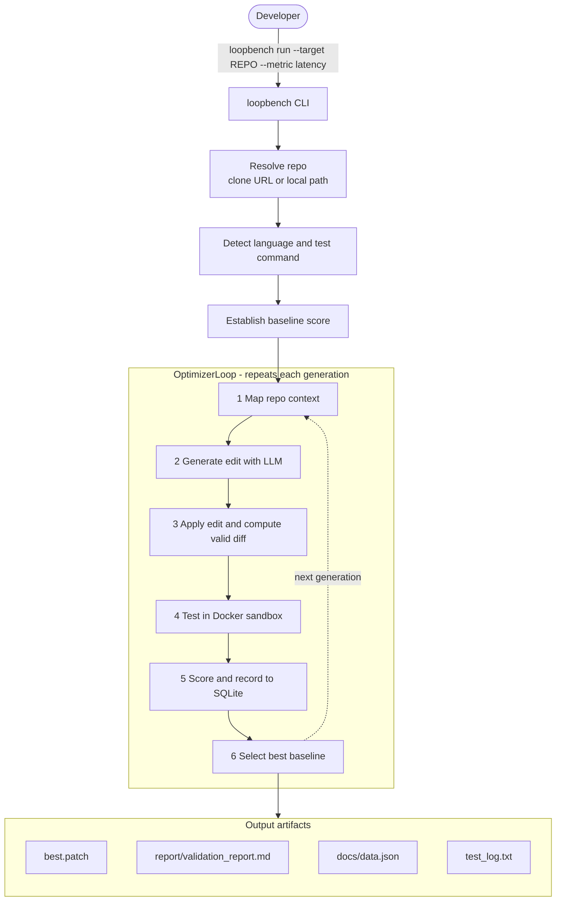
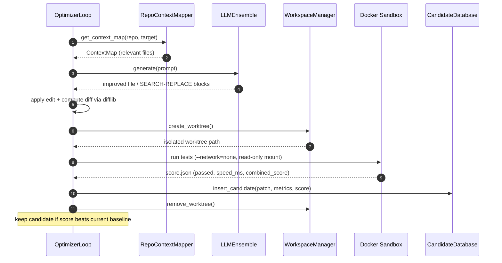
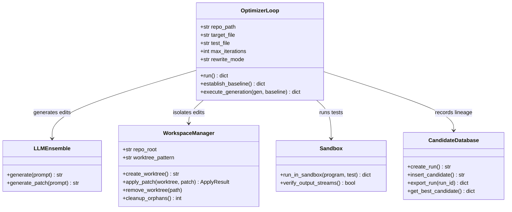

<div align="center">

# ⚡ LoopBench Optimizer

**Autonomous evolutionary code optimization — powered by LLMs**

*Point it at any GitHub repository. Watch it evolve your code to run faster.*

[](LICENSE)
[](pyproject.toml)
[](https://github.com/manashatwar/LoopBench-Optimizer/actions/workflows/ci.yml)
[](https://github.com/manashatwar/LoopBench-Optimizer/actions/workflows/sandbox-image.yml)

</div>

---

## Architecture



### One generation, step by step



> **Per-subsystem architecture:** see [`docs/architecture/`](docs/architecture/README.md)
> for individual diagrams of the [Ghost Worktree System](docs/architecture/ghost-worktree-system.md),
> [Repo Context Mapper](docs/architecture/repo-context-mapper.md),
> [LLM Editing Engine](docs/architecture/llm-editing.md),
> [Docker Sandbox](docs/architecture/docker-sandbox.md),
> [Candidate Database](docs/architecture/candidate-database.md), and
> [Search Strategy](docs/architecture/search-strategy.md).

### Core components



---

## What It Does

LoopBench Optimizer runs a closed-loop, multi-generation optimization cycle:

1. **Map** — builds an LLM-ready context map of your repository
2. **Generate** — asks an LLM to improve the target file (see [Editing Strategies](#editing-strategies))
3. **Apply** — applies the change in an isolated git worktree and computes a valid `.patch`
4. **Test** — runs your test suite inside a Docker sandbox (`--network=none`, read-only mount)
5. **Extract** — parses performance metrics from test output
6. **Record** — stores the attempt in a SQLite audit database
7. **Select** — picks the best candidate as the next baseline

Each generation learns from previous failures, compounding improvements over time.

---

## Quick Start

> New here? The [**5-minute Quick Start**](QUICKSTART.md) walks you from clone to
> a verified optimization step by step.

There is one command — `loopbench run`. First, install and add your LLM key:

```bash
pip install -e .
cp .env.example .env        # then edit .env with your key:
#   GEMINI_API_KEY="..."                              # any OpenAI-compatible provider
#   LLM_API_BASE="https://api.groq.com/openai/v1"     # Groq, Gemini, OpenAI, …
#   LLM_MODEL="llama-3.3-70b-versatile"
```

To optimize code, LoopBench needs **the file** *and* **a test that measures it**
(so it can prove each change is faster and still correct). Two situations:

```bash
# A) The file already has a test that times it → run directly:
loopbench run --target . --target-file src/hotpath.py --metric latency -i 5

# B) Any other repo (no test yet) → scaffold a tiny one, then run:
loopbench init --job my_job                    # creates my_job/loopbench.yaml + test_target.py
#   edit the two files (repo/file + what to test), then:
loopbench run --config my_job/loopbench.yaml
```

Case **B** is the usual path for someone else's repo — see
[Optimize any repo](#optimize-any-repo) below for the details.

Minutes later you get four artifacts:

| Artifact | Path | What it is |
|----------|------|------------|
| Patch | `loopbench_output/best.patch` | Verified, ready-to-apply unified diff of the best improvement |
| Validation report | `loopbench_output/report/validation_report.md` | Before/after metrics and patch status |
| Dashboard data | `docs/data.json` | Feeds the GitHub Pages dashboard |
| Test log | `loopbench_output/test_log.txt` | Proof the winning patch kept every test passing |

> Requires Docker Desktop running (tests execute in an isolated sandbox).

---

## Optimize any repo

This is the usual path (case **B** above): for someone else's repo — or any file
without a test yet — keep everything in a small **job folder in your own
workspace**. You never edit files inside the target repo. Scaffold it in one
command, so you only fill in configuration:

```bash
loopbench init --job my_job      # creates my_job/loopbench.yaml + my_job/test_target.py
```

Then edit two files and run:

**1. `my_job/loopbench.yaml`** — point it at the repo, the file to optimize, and deps:

```yaml
target:
  repo: https://github.com/OWNER/REPO     # cloned automatically (or a local path)
  file: path/in/repo/module.py            # the file to optimize
  evaluator: test_target.py               # this job's test (below)
sandbox:
  command: "pytest test_target.py -v -s -q"
  pip: ["numpy"]                          # installed in the sandbox
metric:      { name: "combined_score", threshold: 0.95 }
constraints: { max_iterations: 10, max_tokens_total: 200000 }
```

**2. `my_job/test_target.py`** — fill in the two TODOs: a correctness check and a
speed workload that prints `LOOPBENCH_SPEED_MS`.

```bash
loopbench run --config my_job/loopbench.yaml
```

LoopBench clones the repo, installs the deps, and optimizes the file using your
test — the target repo stays untouched. See
[**Defining Your Benchmark**](docs/defining-benchmarks.md) for all the options
(dependencies, cost/runtime budgets, custom test commands, stdin/run mode).

---

## Editing Strategies

LLMs are unreliable at emitting byte-exact unified diffs (they fail 20–30% of the
time with "corrupt patch" errors). LoopBench avoids this entirely — the LLM never
hand-writes diff line numbers. Instead it uses one of three modes (`rewrite_mode`),
and the `.patch` is always computed programmatically with `difflib` so it is
guaranteed valid:

| Mode | How the LLM edits | Best for |
|------|-------------------|----------|
| `full` | Returns the complete improved file | Small files |
| `search_replace` | Returns `SEARCH`/`REPLACE` edit blocks, applied by content match with fuzzy fallback | Large files (surgical, token-efficient) |
| `auto` *(default for `loopbench run`)* | Picks `full` for files ≤ 300 lines, `search_replace` for larger | Any repo |

Verified in practice: a **1,233-line** file routed to `search_replace` produced a
**27-line surgical patch** (only the hot function changed) with a measured speedup.

---

## Project Structure

```
LoopBench-Optimizer/
│
├── openevolve/                  # Core library (extended from OpenEvolve fork)
│   ├── cli.py                   # optimizer CLI entry point (init/run/resume/export/dashboard)
│   ├── optimizer_loop.py        # 7-phase orchestrator
│   ├── search_strategy.py       # GreedySearch, BeamSearch, RandomRestartSearch
│   ├── repo_manager.py          # clone_repository, detect_language, detect_test_framework
│   ├── config_validator.py      # validate_optimizer_config, generate_template
│   ├── report_generator.py      # FinalReportWriter (patch, validation, README, PR)
│   ├── database.py              # CandidateDatabase with SQLite audit trail
│   ├── metric_parser.py         # MetricParser (regex + JSON patterns)
│   ├── workspace_manager.py     # git worktree isolation
│   ├── llm/                     # LLM providers (OpenAI, Anthropic, Ollama)
│   │   ├── base.py              # extract_patch_from_response, retry logic
│   │   └── ensemble.py          # generate_patch with exponential backoff
│   └── repo_mapper/             # repository-to-context mapper
│       ├── mapper.py            # RepoContextMapper
│       └── optimizer_prompt.py  # create_optimizer_prompt (baseline + failure history)
│
├── sandbox/                     # Docker sandbox execution
│   ├── runner.py                # run_in_sandbox, verify_output_streams
│   ├── entrypoint.sh            # container entrypoint
│   └── Dockerfile.sandbox       # test execution image
│
├── loopbench/                   # LoopBench CLI + run pipeline
│   ├── cli.py                   # run (direct + --config) / init (--job) / check
│   ├── hero.py                  # clone → optimize → emit patch + dashboard + log
│   ├── scaffold.py              # `init --job` job-folder generator
│   ├── deps.py                  # dependency detection (requirements/pyproject/imports)
│   └── io_harness.py            # run mode: stdin/stdout subprocess harness
│
├── docs/                        # Static GitHub Pages dashboard
│   └── index.html               # Single-file React dashboard (no build step)
│
├── configs/                     # Example configuration files
│   ├── default_config.yaml
│   └── loopbench_default.yaml
│
├── examples/                    # Example optimization problems
│   └── ...
│
├── tests/                       # Test suite (unit + property + integration)
│   ├── property/                # Hypothesis property-based tests
│   ├── integration/
│   ├── test_optimizer_loop*.py  # OptimizerLoop tests
│   ├── test_search_replace_edits.py  # SEARCH/REPLACE block parsing + apply
│   ├── test_hero_command.py     # loopbench run (--target) unit tests
│   ├── test_search_strategy.py
│   ├── test_config_validator.py
│   ├── test_report_generator.py
│   ├── test_optimizer_cli.py
│   ├── test_audit_trail.py
│   ├── test_dashboard.py
│   ├── test_repo_manager.py
│   └── test_end_to_end.py
│
├── pyproject.toml               # Package config + entry points
├── Makefile                     # Common dev commands
└── LICENSE
```

---

## Command reference

The two run styles are shown in [Quick Start](#quick-start) and
[Optimize any repo](#optimize-any-repo). One more handy command:

```bash
loopbench check --config my_job/loopbench.yaml   # validate a job + dry-run its test first
```

Common `loopbench run` flags (full list via `loopbench run --help`):

| Flag | Purpose |
|------|---------|
| `--target`, `--target-file` | Repo (URL/path) and the file to optimize |
| `--metric` | Metric to optimize (default `combined_score`) |
| `--pip "numpy scipy"` | Sandbox dependencies (else auto-detected) |
| `--test-command` | Use a custom test/benchmark command |
| `--io-tests <file>` | Run mode for stdin/stdout scripts |
| `--max-tokens` / `--max-cost` / `--max-runtime` | Cost / time budgets |
| `-i`, `-o` | Iterations, output directory |

See [**Defining Your Benchmark**](docs/defining-benchmarks.md) for every scoring
option in depth. The separate `optimizer` CLI runs the **same** LLM + evaluator
loop with a heavier search strategy (OpenEvolve MAP-Elites / islands) — most
users won't need it.

---

## Dashboard

Every run writes `docs/data.json`. View it locally or publish it:

```bash
python -m http.server 8080 --directory docs        # local: open http://localhost:8080
git add docs/data.json && git commit -m "results" && git push   # GitHub Pages
# published at: https://manashatwar.github.io/LoopBench-Optimizer/
```

---

## Running Tests

```bash
# Full test suite
pytest tests/ -v

# Property-based tests only
pytest tests/property/ -v

# End-to-end tests
pytest tests/test_end_to_end.py -v
```

---

## What This Fork Adds

Built on top of the [OpenEvolve](https://github.com/algorithmicsuperintelligence/openevolve) evolutionary coding agent. The fork adds:

- **One-command optimization** — `loopbench run --target <url|path> --metric <name>`
- **Repository-level optimization** (full repo context, not just single files)
- **Robust LLM editing** — full-rewrite + search/replace edit blocks with `auto`
  size-based routing; the `.patch` is always computed with `difflib` (no corrupt patches)
- **Git worktree isolation** per generation
- **Docker sandbox** test execution (`--network=none`, read-only mount)
- **7-phase orchestration** with explicit phase tracking
- **SQLite audit trail** with full lineage
- **Bounded runs** — stop on a token (`--max-tokens`), dollar (`--max-cost`), runtime (`--max-runtime`), or iteration budget; per-generation token/cost is logged and reported
- **Any sandbox command** — `pytest` by default, or bring your own via `--test-command` (benchmarks, type checks, plain scripts); non-pytest correctness comes from the exit code
- **Automatic dependencies** — detects the target's Python packages (`requirements.txt` or scanned imports) and installs them into a cached sandbox image; override with `--pip`
- **Custom metric** — `--metric <name>` optimizes whichever metric your evaluator emits (falls back to `combined_score`)
- **Run mode** — optimize stdin/stdout scripts (competitive-programming solutions, CLI tools) via `--io-tests`
- **GitHub Pages dashboard** (no server required for sharing)
- **Provider-agnostic LLM** via `LLM_API_BASE` / `LLM_MODEL` (Groq, Gemini, OpenAI, …)

---

## License

Apache-2.0 — see [LICENSE](LICENSE). LoopBench Optimizer is a fork of
[OpenEvolve](https://github.com/algorithmicsuperintelligence/openevolve), which
is also licensed under Apache-2.0.
