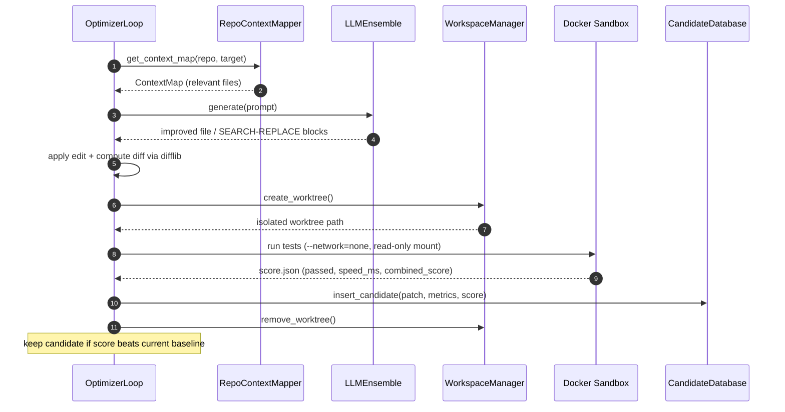
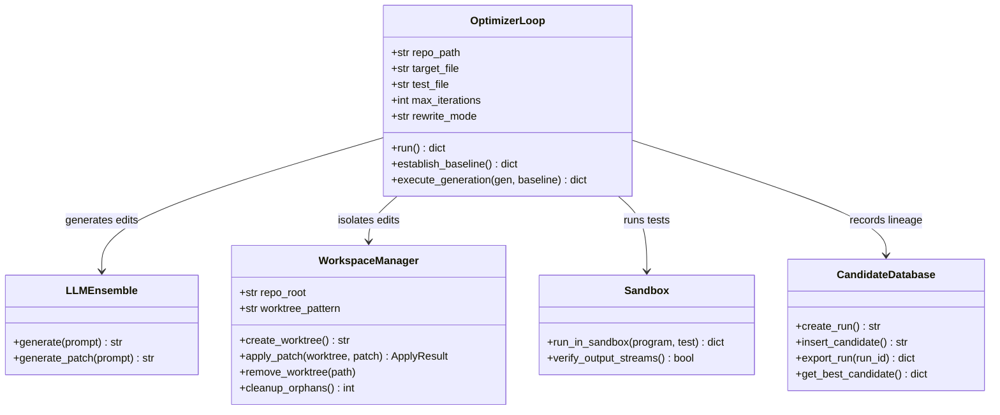

<div align="center">

# ⚡ LoopBench Optimizer

**Autonomous evolutionary code optimization — powered by LLMs**

*Point it at any GitHub repository. Watch it evolve your code to run faster.*

[](LICENSE)
[](pyproject.toml)
[](https://github.com/manashatwar/LoopBench-Optimizer/actions/workflows/ci.yml)
[](https://github.com/manashatwar/LoopBench-Optimizer/actions/workflows/sandbox-image.yml)

</div>

---

## Architecture


### One generation, step by step



> **Per-subsystem architecture:** see [`docs/architecture/`](docs/architecture/README.md)
> for individual diagrams of the [Ghost Worktree System](docs/architecture/ghost-worktree-system.md),
> [Repo Context Mapper](docs/architecture/repo-context-mapper.md),
> [LLM Editing Engine](docs/architecture/llm-editing.md),
> [Docker Sandbox](docs/architecture/docker-sandbox.md),
> [Candidate Database](docs/architecture/candidate-database.md), and
> [Search Strategy](docs/architecture/search-strategy.md).

### Core components



---

## What It Does

LoopBench Optimizer runs a closed-loop, multi-generation optimization cycle:

1. **Map** — builds an LLM-ready context map of your repository
2. **Generate** — asks an LLM to improve the target file (see [Editing Strategies](#editing-strategies))
3. **Apply** — applies the change in an isolated git worktree and computes a valid `.patch`
4. **Test** — runs your test suite inside a Docker sandbox (`--network=none`, read-only mount)
5. **Extract** — parses performance metrics from test output
6. **Record** — stores the attempt in a SQLite audit database
7. **Select** — picks the best candidate as the next baseline

Each generation learns from previous failures, compounding improvements over time.

---

## Quick Start — one command

> New here? The [**5-minute Quick Start**](QUICKSTART.md) walks you from clone to
> a verified optimization step by step.


Point LoopBench at any repo (GitHub URL or local path) and let it evolve your code:

```bash
# Install
pip install -e .

# Set your LLM key in .env (any OpenAI-compatible provider — Groq, Gemini, OpenAI…)
#   GEMINI_API_KEY="..."
#   LLM_API_BASE="https://api.groq.com/openai/v1"
#   LLM_MODEL="llama-3.3-70b-versatile"

# Run the optimizer end-to-end
loopbench run --target https://github.com/user/slow-repo --metric latency

# …or a local path, naming the file to optimize
loopbench run --target . --target-file src/hotpath.py --metric latency -i 5
```

Minutes later you get four artifacts:

| Artifact | Path | What it is |
|----------|------|------------|
| Patch | `loopbench_output/best.patch` | Verified, ready-to-apply unified diff of the best improvement |
| Validation report | `loopbench_output/report/validation_report.md` | Before/after metrics and patch status |
| Dashboard data | `docs/data.json` | Feeds the GitHub Pages dashboard |
| Test log | `loopbench_output/test_log.txt` | Proof the winning patch kept every test passing |

> Requires Docker Desktop running (tests execute in an isolated sandbox).

> **Optimizing your own file or repo?** See [Defining Your Benchmark](docs/defining-benchmarks.md)
> for the three ways to tell LoopBench what "better" means (with full commands).

---

## Editing Strategies

LLMs are unreliable at emitting byte-exact unified diffs (they fail 20–30% of the
time with "corrupt patch" errors). LoopBench avoids this entirely — the LLM never
hand-writes diff line numbers. Instead it uses one of three modes (`rewrite_mode`),
and the `.patch` is always computed programmatically with `difflib` so it is
guaranteed valid:

| Mode | How the LLM edits | Best for |
|------|-------------------|----------|
| `full` | Returns the complete improved file | Small files |
| `search_replace` | Returns `SEARCH`/`REPLACE` edit blocks, applied by content match with fuzzy fallback | Large files (surgical, token-efficient) |
| `auto` *(default for `loopbench run`)* | Picks `full` for files ≤ 300 lines, `search_replace` for larger | Any repo |

Verified in practice: a **1,233-line** file routed to `search_replace` produced a
**27-line surgical patch** (only the hot function changed) with a measured speedup.

---

## Alternative: config-driven runs

For repeatable runs with a full 6-section config, use the `optimizer` CLI:

```bash
optimizer init --output optimizer.yaml   # generate a template
optimizer run --config optimizer.yaml    # run
optimizer dashboard --run-id <id> --open # view results
```

---

## Project Structure

```
LoopBench-Optimizer/
│
├── openevolve/                  # Core library (extended from OpenEvolve fork)
│   ├── cli.py                   # optimizer CLI entry point (init/run/resume/export/dashboard)
│   ├── optimizer_loop.py        # 7-phase orchestrator
│   ├── search_strategy.py       # GreedySearch, BeamSearch, RandomRestartSearch
│   ├── repo_manager.py          # clone_repository, detect_language, detect_test_framework
│   ├── config_validator.py      # validate_optimizer_config, generate_template
│   ├── report_generator.py      # FinalReportWriter (patch, validation, README, PR)
│   ├── database.py              # CandidateDatabase with SQLite audit trail
│   ├── metric_parser.py         # MetricParser (regex + JSON patterns)
│   ├── workspace_manager.py     # git worktree isolation
│   ├── llm/                     # LLM providers (OpenAI, Anthropic, Ollama)
│   │   ├── base.py              # extract_patch_from_response, retry logic
│   │   └── ensemble.py          # generate_patch with exponential backoff
│   └── repo_mapper/             # repository-to-context mapper
│       ├── mapper.py            # RepoContextMapper
│       └── optimizer_prompt.py  # create_optimizer_prompt (baseline + failure history)
│
├── sandbox/                     # Docker sandbox execution
│   ├── runner.py                # run_in_sandbox, verify_output_streams
│   ├── entrypoint.sh            # container entrypoint
│   └── Dockerfile.sandbox       # test execution image
│
├── loopbench/                   # LoopBench CLI — the `loopbench run` hero command
│   ├── cli.py                   # run (--target/--metric) / init / check
│   └── hero.py                  # clone → optimize → emit patch + dashboard + log
│
├── docs/                        # Static GitHub Pages dashboard
│   └── index.html               # Single-file React dashboard (no build step)
│
├── configs/                     # Example configuration files
│   ├── default_config.yaml
│   └── loopbench_default.yaml
│
├── examples/                    # Example optimization problems
│   └── ...
│
├── tests/                       # Test suite (unit + property + integration)
│   ├── property/                # Hypothesis property-based tests
│   ├── integration/
│   ├── test_optimizer_loop*.py  # OptimizerLoop tests
│   ├── test_search_replace_edits.py  # SEARCH/REPLACE block parsing + apply
│   ├── test_hero_command.py     # loopbench run --target unit tests
│   ├── test_search_strategy.py
│   ├── test_config_validator.py
│   ├── test_report_generator.py
│   ├── test_optimizer_cli.py
│   ├── test_audit_trail.py
│   ├── test_dashboard.py
│   ├── test_repo_manager.py
│   └── test_end_to_end.py
│
├── pyproject.toml               # Package config + entry points
├── Makefile                     # Common dev commands
└── LICENSE
```

---

## CLI Commands

### `loopbench` — the hero command

```bash
# Optimize any repo end-to-end (clone URL or local path)
loopbench run --target https://github.com/user/repo --metric latency
loopbench run --target . --target-file src/main.py --metric latency -i 5

# Options
#   --target        GitHub URL or local path
#   --target-file   file to optimize (relative to repo root)
#   --metric        metric name to optimize (default: combined_score)
#   --test-command  override the auto-detected test command
#   -i / --iterations   max generations (default: 5)
#   -o / --output   output directory (default: loopbench_output/)

# Scaffold / validate an evaluator-first config (optional)
loopbench init  --name my_project
loopbench check --config loopbench.yaml
```

### `optimizer` — config-driven runs

```bash
# Generate a config template (all 6 required sections)
optimizer init --output optimizer.yaml

# Run an optimization
optimizer run --config optimizer.yaml --max-iterations 50 --output results/

# Resume an interrupted run
optimizer resume --run-id <id> --db optimizer.db

# Export run data
optimizer export --run-id <id> --format json
optimizer export --run-id <id> --format markdown

# Launch the dashboard
optimizer dashboard --run-id <id> --open          # local server + browser
optimizer dashboard --run-id <id> --no-server     # generate docs/data.json only
```

---

## Dashboard

The dashboard runs in two modes:

**GitHub Pages (static)** — commit `docs/data.json` to share results publicly:
```bash
optimizer dashboard --run-id <id> --no-server
git add docs/data.json && git push
# View at: https://manashatwar.github.io/LoopBench-Optimizer/
```

**Local live server** — monitor an active run in real time:
```bash
optimizer dashboard --run-id <id> --port 8080 --open
# Auto-refreshes every N seconds via ?refresh=N
```

---

## Configuration

The optimizer requires a YAML config with exactly 6 sections:

```yaml
repository:
  url: "https://github.com/your-org/repo.git"
  target_files: ["src/main.py"]
  auth_token: "${GITHUB_TOKEN}"

llm:
  # Any OpenAI-compatible provider (Groq, Gemini, OpenAI, Ollama, …)
  provider: "openai"
  model: "llama-3.3-70b-versatile"
  api_base: "https://api.groq.com/openai/v1"
  api_key: "${GEMINI_API_KEY}"   # var name is read from .env

docker:
  test_command: "pytest --benchmark-only -v"
  timeout: 300

database:
  path: "./optimizer.db"

metrics:
  patterns:
    execution_time: 'Mean: ([\d.]+) seconds'
  success_threshold: 0.10

search:
  strategy: "greedy"   # greedy | beam | random_restart
  max_iterations: 50
  patience: 10
```

Generate a full template with: `optimizer init`

---

## Search Strategies

| Strategy | Description | Parallelizable |
|----------|-------------|---------------|
| `greedy` | Always use the single best candidate | No |
| `beam` | Top-K random selection (`beam_width`) | Yes |
| `random_restart` | Periodically revert to baseline (`restart_interval`) | No |

---

## Running Tests

```bash
# Full test suite
pytest tests/ -v

# Property-based tests only
pytest tests/property/ -v

# End-to-end tests
pytest tests/test_end_to_end.py -v
```

---

## What This Fork Adds

Built on top of the [OpenEvolve](https://github.com/algorithmicsuperintelligence/openevolve) evolutionary coding agent. The fork adds:

- **One-command optimization** — `loopbench run --target <url|path> --metric <name>`
- **Repository-level optimization** (full repo context, not just single files)
- **Robust LLM editing** — full-rewrite + search/replace edit blocks with `auto`
  size-based routing; the `.patch` is always computed with `difflib` (no corrupt patches)
- **Git worktree isolation** per generation
- **Docker sandbox** test execution (`--network=none`, read-only mount)
- **7-phase orchestration** with explicit phase tracking
- **SQLite audit trail** with full lineage
- **GitHub Pages dashboard** (no server required for sharing)
- **Provider-agnostic LLM** via `LLM_API_BASE` / `LLM_MODEL` (Groq, Gemini, OpenAI, …)

---

## License

Apache-2.0 — see [LICENSE](LICENSE). LoopBench Optimizer is a fork of
[OpenEvolve](https://github.com/algorithmicsuperintelligence/openevolve), which
is also licensed under Apache-2.0.
