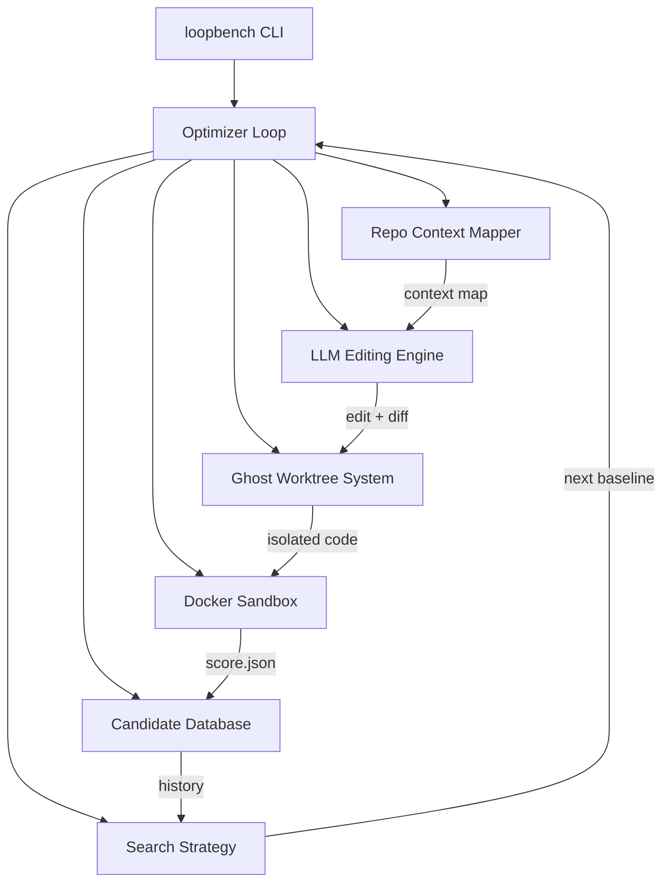

# LoopBench Architecture

Per-subsystem architecture references. Each document is self-contained with
Mermaid diagrams that render directly on GitHub.

| Subsystem | What it does |
|-----------|--------------|
| [Optimizer Loop](optimizer-loop.md) | The generation orchestrator that ties every subsystem together |
| [Ghost Worktree System](ghost-worktree-system.md) | Isolated, disposable git worktrees per candidate |
| [Repo Context Mapper](repo-context-mapper.md) | Builds an LLM-ready, token-budgeted map of the repository |
| [LLM Editing Engine](llm-editing.md) | Full-rewrite / search-replace / auto edit strategies |
| [Docker Sandbox](docker-sandbox.md) | Network-isolated, read-only test execution |
| [Candidate Database](candidate-database.md) | SQLite audit trail of runs, candidates, and events |
| [Search Strategy](search-strategy.md) | How the next baseline is chosen each generation |

## System overview

