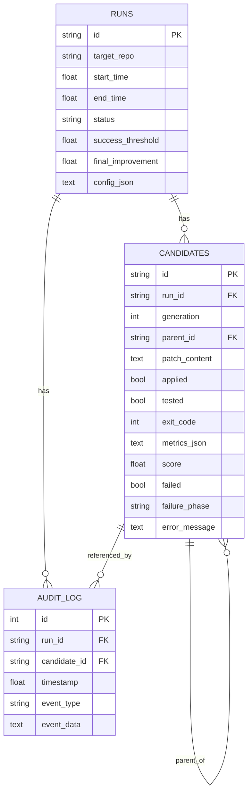
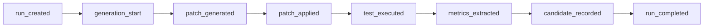

# Candidate Database

`openevolve/database.py` — a SQLite audit trail (via SQLAlchemy) that records
every run, every candidate, and every event with full parent-child lineage.
Foreign keys are enforced (`PRAGMA foreign_keys=ON`).

## Schema

## Event trail

Every meaningful step appends an `audit_log` row, giving a replayable history:

## Key operations

| Method | Role |
|--------|------|
| `create_run(...)` | Open a run row + `run_created` event |
| `insert_candidate(...)` | Insert/update a candidate (upsert) + event |
| `update_candidate_results(...)` | Attach test output, metrics, score |
| `get_recent_failures(window)` | Feed prior failures back into the prompt |
| `get_best_candidate(run_id)` | Highest-scoring candidate for a run |
| `complete_run(...)` | Close the run + record final improvement |
| `export_run(run_id)` | Full JSON export (feeds `docs/data.json`) |
| `export_audit_trail(run_id)` | Human-readable Markdown of the whole run |

## Storage notes

- A `.db`/`.sqlite` path is used directly as the audit database.
- A directory path stores audit data at `optimizer_audit.sqlite3` inside it.
- `:memory:` keeps everything in-memory (used by tests).
