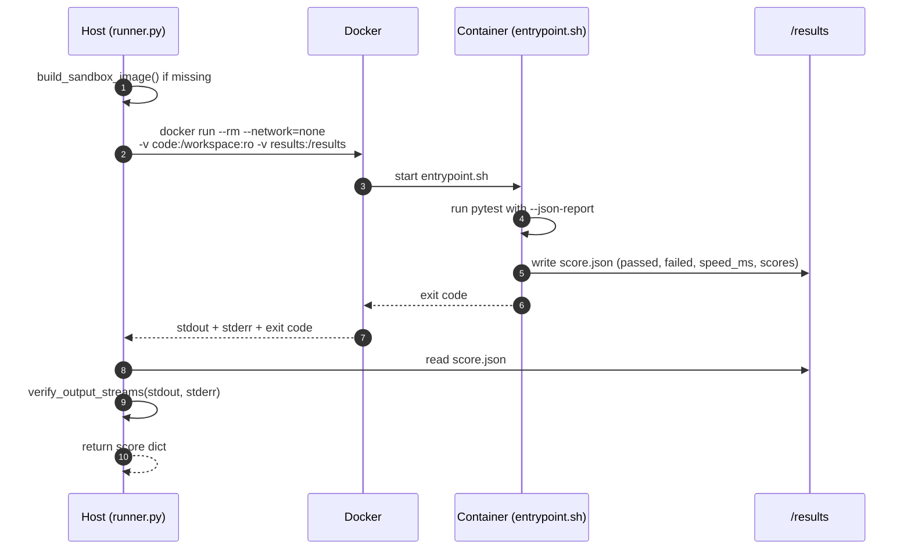

# Docker Sandbox

`sandbox/` — runs a candidate's tests inside a locked-down container and returns
a structured score. Untrusted, LLM-generated code never runs on the host.

## Execution flow



## Isolation guarantees

| Control | Effect |
|---------|--------|
| `--network=none` | No outbound network from the container |
| `-v code:/workspace:ro` | Evolved code is mounted read-only |
| `--rm` | Container is destroyed after each run |
| timeout | A hung test cannot block the loop (stop + force-kill) |

## score.json contract

The container writes `/results/score.json`; the host normalizes it into:

```json
{
  "passed": 13, "failed": 0, "errors": 0, "total": 13,
  "speed_ms": 1.47, "correctness": 1.0,
  "speed_score": 0.99, "combined_score": 0.99,
  "all_passed": true
}
```

`combined_score = correctness * speed_score`, where `speed_score` decays
exponentially with `speed_ms`. A missing or unparseable `score.json`, or a
failure to capture both output streams, is treated as a failed candidate.

## Public interface (`sandbox/runner.py`)

| Function | Role |
|----------|------|
| `build_sandbox_image(...)` | Build `loopbench-sandbox` if not present |
| `run_in_sandbox(program, test, ...)` | Run tests, return the score dict |
| `verify_output_streams(stdout, stderr)` | Assert both streams were captured |
| `make_sandboxed_evaluator(...)` | Wrap an evaluator to route through Docker |
