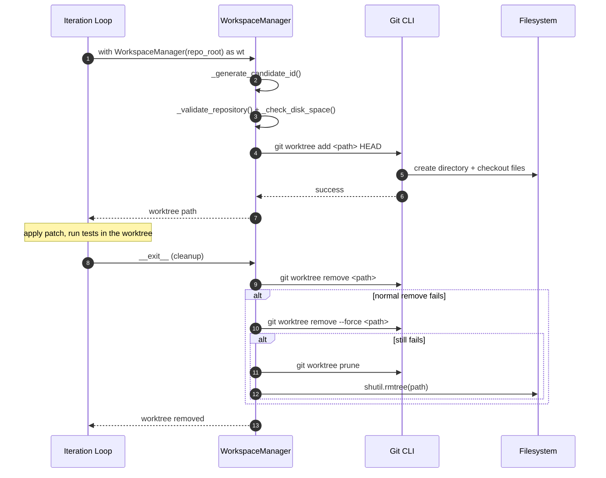
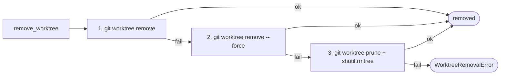
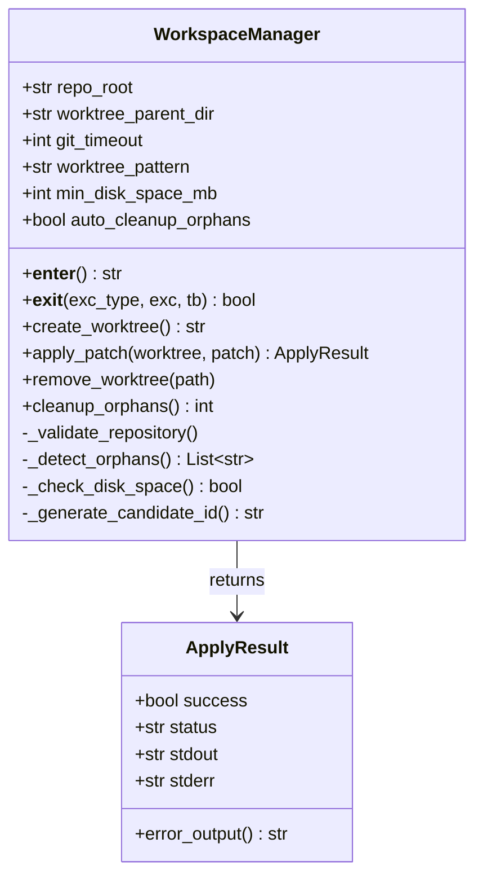

# Ghost Worktree System

`openevolve/workspace_manager.py` — `WorkspaceManager` gives each candidate its
own throwaway git worktree so mutations never touch the developer's checkout.
It is a context manager: the worktree is created on `__enter__` and always
cleaned up on `__exit__`, even when an exception is raised.

## Lifecycle



## 3-stage cascading cleanup

Removal never leaves ghosts behind — it escalates through three strategies:



## Patch application (lenient)

`apply_patch` tries progressively more tolerant `git apply` option sets so a
semantically valid patch still lands despite minor formatting drift:

```
1. strict            git apply
2. --ignore-whitespace
3. --recount --ignore-whitespace
4. -C1 --recount --ignore-whitespace
5. --3way
```

Each attempt is checked (`git apply --check`) before it mutates files; a failed
verification is rolled back before the next option set is tried.

## Class



## Safety properties

- **Path confinement** — resolved worktree path must stay inside
  `worktree_parent_dir`; traversal attempts are rejected.
- **Disk guard** — refuses to create a worktree below `min_disk_space_mb`.
- **Orphan sweep** — `cleanup_orphans()` (optionally on init) removes
  `temp_worktree_*` directories left by crashed runs.
