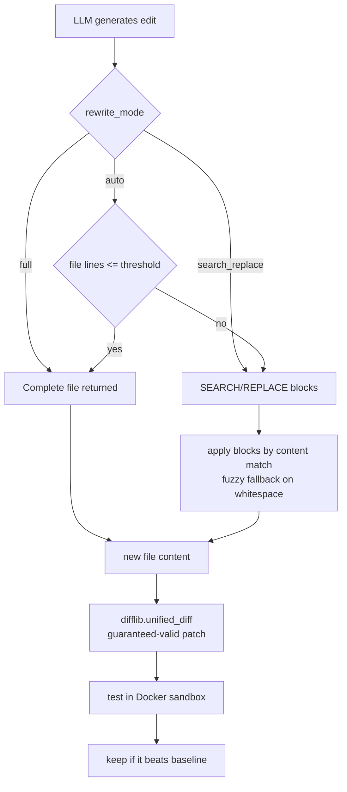
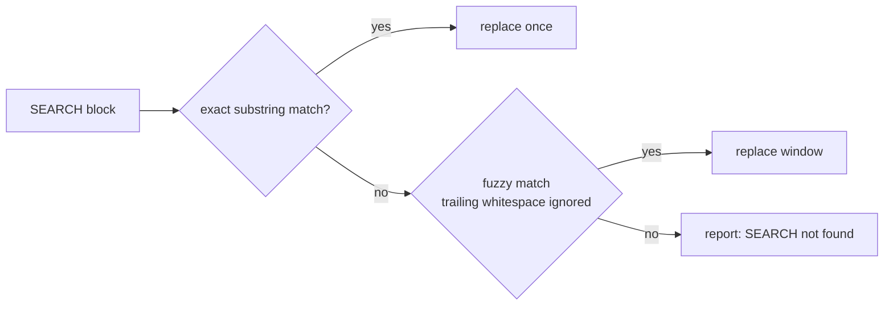

# LLM Editing Engine

The engine that turns an LLM response into a verified `.patch`. Unified diffs
written by hand by an LLM fail 20–30% of the time ("corrupt patch"), so the LLM
**never writes diff line numbers** — the diff is always computed with `difflib`.

## Strategy routing



## Modes

| Mode | LLM returns | Applied by | Best for |
|------|-------------|-----------|----------|
| `full` | The complete improved file | Overwrite | Small files |
| `search_replace` | `SEARCH`/`REPLACE` blocks | Exact match, then whitespace-tolerant fuzzy match | Large files (surgical) |
| `auto` | Chosen by file size | `full` ≤ 300 lines, else `search_replace` | Any repo (default) |
| `diff` | A unified diff | `git apply` (lenient) | Legacy / advanced |

## Search / Replace block format

```
<<<<<<< SEARCH
<exact lines copied from the file>
=======
<the replacement lines>
>>>>>>> REPLACE
```

Application order:



Leading indentation is preserved (Python-significant); only trailing whitespace
is tolerated during fuzzy matching.

## Why difflib for the patch

Because the patch is derived from the actual before/after file contents, it is
always a valid unified diff that `git apply` accepts — regardless of how the LLM
phrased its edit. Verified on a 1,233-line file: `search_replace` produced a
27-line surgical patch touching only the hot function.
