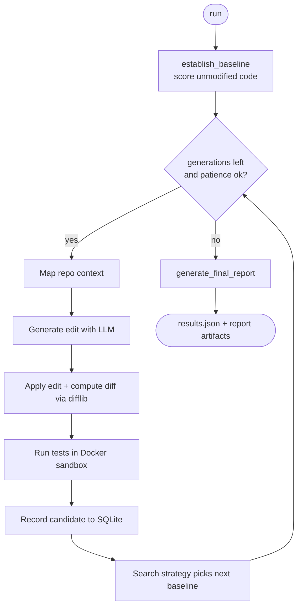
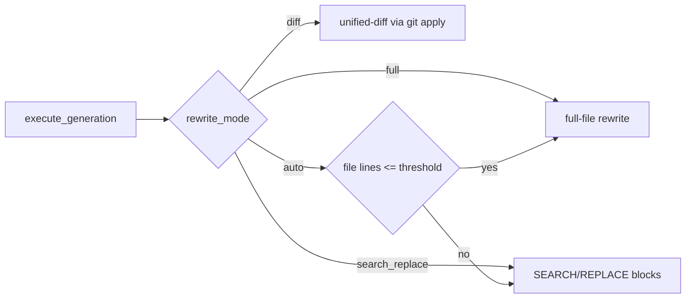

# Optimizer Loop

`openevolve/optimizer_loop.py` — the orchestrator. It establishes a baseline,
then runs generations until the metric stops improving (early stopping via
`patience`) or `max_iterations` is reached.

## Generation cycle

## Responsibilities

| Method | Role |
|--------|------|
| `establish_baseline()` | Runs the original code once; records generation 0 |
| `execute_generation(gen, baseline)` | One full cycle; routes to the editing mode |
| `run()` | Baseline → loop → early stopping → final report |
| `generate_final_report(...)` | Improvement %, status, best/baseline candidates |

## Early stopping

- `patience` — stop after N consecutive generations with no improvement.
- `success_threshold` — improvement above this marks the run `successful`.
- Any generation error is recorded as a failed candidate; the loop continues
  (a `KeyboardInterrupt`/`SystemExit` is re-raised after saving partial state).

## Editing-mode routing

See [LLM Editing Engine](llm-editing.md) for details.
