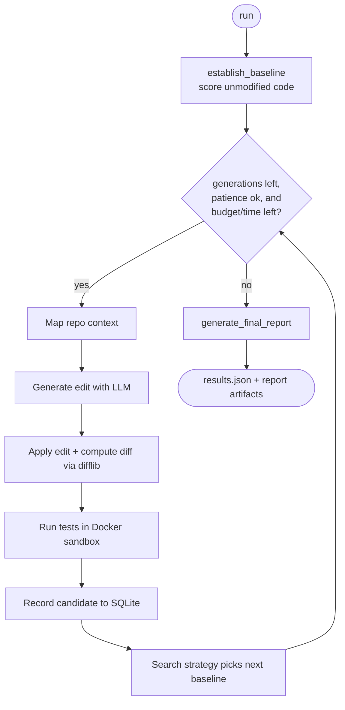
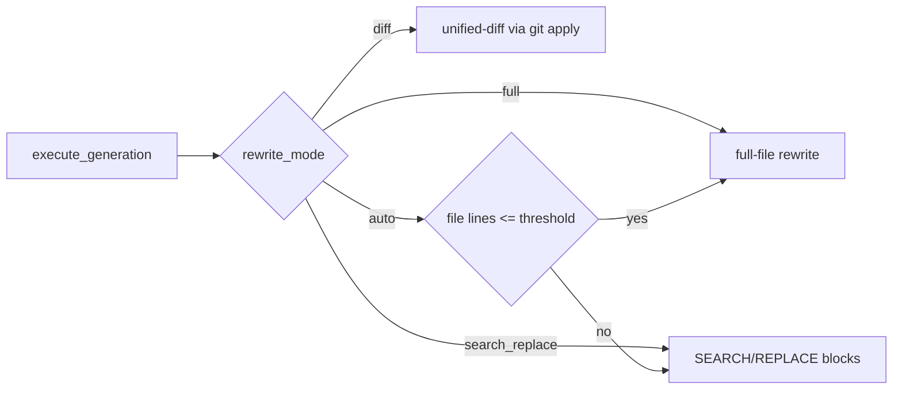

# Optimizer Loop

`openevolve/optimizer_loop.py` — the orchestrator. It establishes a baseline,
then runs generations until the metric stops improving (early stopping via
`patience`) or `max_iterations` is reached.

## Generation cycle

## Responsibilities

| Method | Role |
|--------|------|
| `establish_baseline()` | Runs the original code once; records generation 0 |
| `execute_generation(gen, baseline)` | One full cycle; routes to the editing mode |
| `run()` | Baseline → loop → early stopping → final report |
| `generate_final_report(...)` | Improvement %, status, best/baseline candidates |

## Stopping conditions (bounded loop)

Checked at the top of every generation, before any LLM spend:

| Bound | Config | Effect |
|-------|--------|--------|
| Iterations | `max_iterations` | Hard cap on generations |
| No improvement | `patience` | Stop after N non-improving generations |
| Token budget | `max_tokens_total` | Stop when cumulative LLM tokens reach the cap |
| Cost budget | `max_usd` (+ per-1k pricing) | Stop when estimated USD spend reaches the cap |
| Wall-clock | `max_runtime_seconds` | Stop when elapsed time reaches the deadline |

- `success_threshold` — improvement above this marks the run `successful`.
- Any generation error is recorded as a failed candidate; the loop continues
  (a `KeyboardInterrupt`/`SystemExit` is re-raised after saving partial state).
- Token usage comes from the LLM provider's `usage` field; per-generation
  token/cost deltas are written to the audit log, and the final report carries a
  `cost` summary (tokens, est. USD, and whether a budget/time limit stopped it).

## Scoring & metric selection

Each candidate's score is resolved by `_score_from_metrics`: it uses the metric
named by `metric_name` (`--metric`) when the evaluator/sandbox emits that key
(e.g. `throughput`, `accuracy`), and otherwise falls back to `combined_score`.
The "best" candidate is always the highest-scoring one and never regresses below
the baseline — kept separate from the search strategy's next-baseline choice.

## Editing-mode routing

See [LLM Editing Engine](llm-editing.md) for details.
