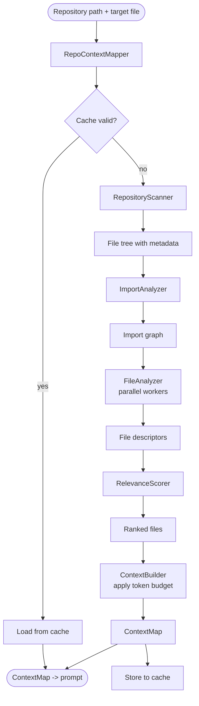
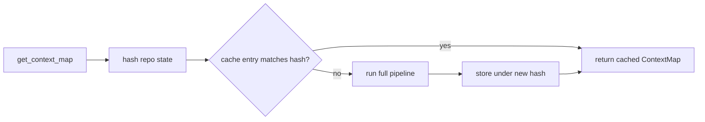

# Repo Context Mapper

`openevolve/repo_mapper/` — turns a whole repository into a compact, ranked,
token-budgeted context map so the LLM sees only the files that matter for the
target. Results are cached and invalidated when the repo changes.

## Pipeline

## Module map

| Module | Role |
|--------|------|
| `scanner.py` | Walk the repo, collect files + metadata |
| `import_analyzer.py` | Build the import/dependency graph |
| `file_analyzer.py` / `performance_optimizer.py` | Summarize each file (parallel) |
| `relevance_scorer.py` | Rank files by relevance to the target |
| `context_builder.py` | Assemble the map within the token budget |
| `cache_manager.py` | Content-hash cache with invalidation |
| `mapper.py` | `RepoContextMapper` — orchestrates the pipeline |
| `optimizer_prompt.py` | Turn the map into the optimization prompt |

## Caching

The cache key is derived from repository content, so any edit invalidates it and
forces a fresh map on the next generation.
