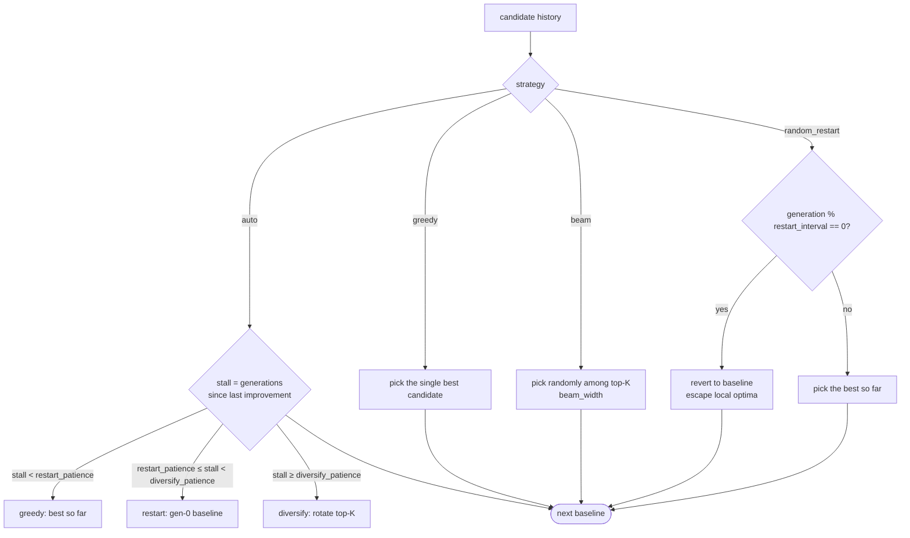
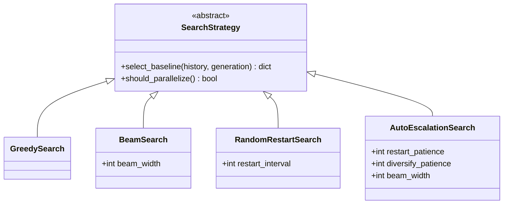

# Search Strategy

`openevolve/search_strategy.py` — decides which candidate becomes the baseline
for the next generation. Selected via `create_strategy(config)`.

## Strategies

## Comparison

| Strategy | Selection | Parallelizable | Use when |
|----------|-----------|----------------|----------|
| `auto` (`AutoEscalationSearch`) **default** | Greedy, then escalates to restart → diversify based on plateau length | No | Zero-config; cheap by default, explores only when stuck |
| `greedy` (`GreedySearch`) | Always the top candidate | No | Fast convergence on smooth landscapes |
| `beam` (`BeamSearch`) | Random among top-`beam_width` | Yes | More exploration; parallel evaluation |
| `random_restart` (`RandomRestartSearch`) | Periodically revert to baseline every `restart_interval` | No | Escaping local optima |

`auto` is deterministic — escalation is driven purely by `stall` (the number of
generations since the last strict improvement in best score), so a rerun
escalates at the exact same generation. It never spends extra LLM calls to
decide, and because escalation only steers *exploration*, the loop still reports
the highest-scoring candidate — `auto` never regresses below plain `greedy`.

## Interface

`create_strategy({"strategy": "beam", "beam_width": 5})` returns the matching
implementation; the `OptimizerLoop` calls `select_baseline(history, generation)`
at the end of every generation. `loopbench run` defaults to `auto`; override it
with `--strategy` or a `search:` block in `loopbench.yaml` (see
[Defining Your Benchmark](../defining-benchmarks.md#search-strategy-auto-tuning)).
