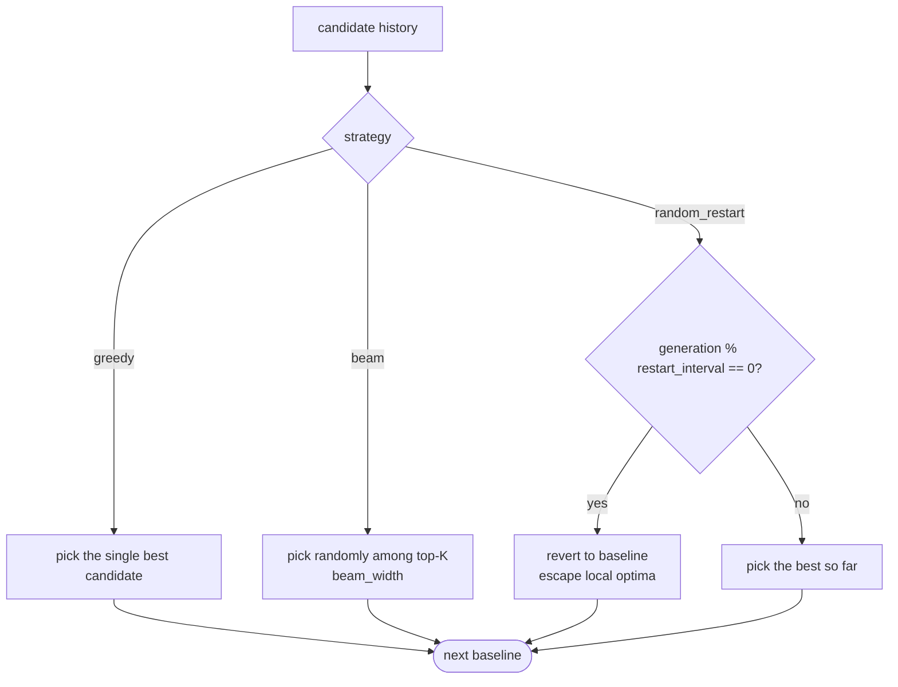
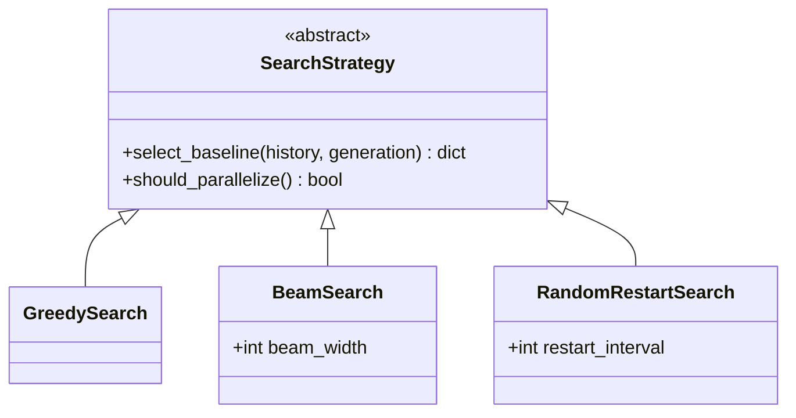

# Search Strategy

`openevolve/search_strategy.py` — decides which candidate becomes the baseline
for the next generation. Selected via `create_strategy(config)`.

## Strategies

## Comparison

| Strategy | Selection | Parallelizable | Use when |
|----------|-----------|----------------|----------|
| `greedy` (`GreedySearch`) | Always the top candidate | No | Fast convergence on smooth landscapes |
| `beam` (`BeamSearch`) | Random among top-`beam_width` | Yes | More exploration; parallel evaluation |
| `random_restart` (`RandomRestartSearch`) | Periodically revert to baseline every `restart_interval` | No | Escaping local optima |

## Interface

`create_strategy({"strategy": "beam", "beam_width": 5})` returns the matching
implementation; the `OptimizerLoop` calls `select_baseline(history, generation)`
at the end of every generation.
