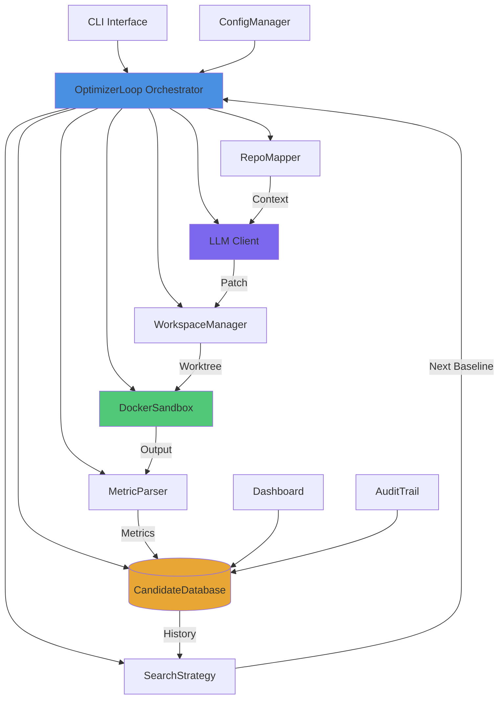

# Design Document: OptimizerLoop

## Overview

The OptimizerLoop is an autonomous evolutionary optimization system that implements a closed-loop, multi-generation code optimization process. The system integrates five major infrastructure components into a continuous improvement cycle that generates, validates, and evolves code optimizations without manual intervention.

### Core Concept

The system operates as a feedback loop:
1. **Map**: Convert repository code into LLM-friendly context
2. **Generate**: Use LLM to create optimization patches based on context and metrics
3. **Apply**: Apply patches to isolated git worktrees
4. **Test**: Execute tests in Docker sandboxes with full output capture
5. **Extract**: Parse performance metrics from test outputs
6. **Record**: Store candidate data in SQLite database
7. **Select**: Choose best candidate as baseline for next generation

Each generation learns from previous attempts, building on successful optimizations and avoiding past failures. The system continues for multiple generations until maximum iterations are reached, early stopping criteria are met, or critical failures occur.

### Design Goals

- **Autonomy**: Minimal human intervention required after configuration
- **Isolation**: Patches tested in clean environments without side effects
- **Traceability**: Complete audit trail of all changes and decisions
- **Robustness**: Graceful error handling and recovery from transient failures
- **Flexibility**: Configurable search strategies and optimization targets
- **Performance**: Efficient parallel execution where applicable
- **Verifiability**: All outputs validated and ready for production use


## Architecture

### High-Level Architecture Diagram



### System Layers

The system is organized into four logical layers:

1. **Interface Layer**: CLI, Dashboard, Configuration
2. **Orchestration Layer**: OptimizerLoop, SearchStrategy
3. **Execution Layer**: RepoMapper, LLMClient, WorkspaceManager, DockerSandbox, MetricParser
4. **Persistence Layer**: CandidateDatabase, AuditTrail


## Components and Interfaces

### 1. OptimizerLoop (Orchestrator)

**Responsibility**: Coordinates the complete optimization cycle across all generations.

**Key Methods**:
```python
class OptimizerLoop:
    def run(self) -> OptimizationResult:
        """Execute the complete multi-generation optimization."""
        
    def execute_generation(self, generation: int, baseline: Candidate) -> Candidate:
        """Execute a single generation cycle."""
        
    def establish_baseline(self) -> Candidate:
        """Test original code and create baseline candidate."""
        
    def should_continue(self, generation: int, history: List[Candidate]) -> bool:
        """Check termination criteria (max iterations, early stopping)."""
        
    def generate_final_report(self) -> Report:
        """Produce summary of optimization run."""
```

**State Management**:
- Current generation number
- Best candidate so far
- Generations without improvement (for early stopping)
- Active worktrees (for cleanup)
- Error history (for LLM feedback)

**Error Handling**:
- Retry failed phases with exponential backoff
- Clean up resources on failure
- Save partial results on critical errors
- Never crash without attempting cleanup


### 2. RepoMapper

**Responsibility**: Convert repository code into LLM-optimized context prompts.

**Key Methods**:
```python
class RepoMapper:
    def map_repository(self, repo_path: Path, target_file: Path) -> RepoContext:
        """Create context including target file and related dependencies."""
        
    def find_related_files(self, target_file: Path) -> List[Path]:
        """Identify files imported by or importing the target file."""
        
    def create_prompt(self, context: RepoContext, baseline_metrics: Metrics, 
                     failures: List[str]) -> str:
        """Generate LLM prompt with context, metrics, and failure feedback."""
```

**Context Strategies**:
- **Minimal**: Target file only
- **Local**: Target file + direct imports
- **Extended**: Target file + transitive dependencies (up to depth 2)
- **Full**: Entire repository (for small codebases)

**Prompt Template**:
```
You are optimizing Python code for performance.

Target File: {filename}
Current Performance: {baseline_metrics}
Optimization Goal: {goal}

Context:
{file_contents}

Recent Failures:
{failure_history}

Generate a git patch to improve performance. Focus on algorithmic improvements.
```


### 3. LLMClient

**Responsibility**: Interface with language models to generate optimization patches.

**Key Methods**:
```python
class LLMClient:
    def generate_patch(self, prompt: str, temperature: float = 0.7) -> PatchResponse:
        """Send prompt to LLM and parse response for patch."""
        
    def extract_patch_from_response(self, response: str) -> Optional[str]:
        """Parse LLM response to extract unified diff patch."""
        
    def retry_with_clarification(self, original_prompt: str, error: str) -> PatchResponse:
        """Retry generation with additional error context."""
```

**Supported Models**:
- OpenAI GPT-4/GPT-3.5
- Anthropic Claude
- Local models via Ollama
- Custom API endpoints

**Patch Extraction**:
1. Look for code blocks marked as `diff` or `patch`
2. Validate unified diff format (starts with `---` and `+++`)
3. Extract multiple hunks if present
4. Return None if no valid patch found

**Retry Strategy**:
- Max retries: 3
- Exponential backoff: 1s, 2s, 4s
- On parse failure: Add clarifying instructions
- On API error: Switch to backup model if configured


### 4. WorkspaceManager

**Responsibility**: Manage git worktrees for isolated patch application.

**Key Methods**:
```python
class WorkspaceManager:
    def create_worktree(self, name: str) -> Path:
        """Create new git worktree in isolated directory."""
        
    def apply_patch(self, worktree: Path, patch: str) -> ApplyResult:
        """Apply patch to worktree and verify success."""
        
    def cleanup_worktree(self, worktree: Path):
        """Remove worktree and associated git metadata."""
        
    def verify_clean_application(self, worktree: Path) -> bool:
        """Check that patch applied without conflicts."""
```

**Worktree Naming**:
- Pattern: `optimizer-gen{N}-{timestamp}-{uuid}`
- Location: `.optimizer/worktrees/`
- Max concurrent: Configurable (default 10)

**Patch Application Process**:
1. Create worktree from current HEAD
2. Apply patch with `git apply --check` first
3. If check passes, apply with `git apply`
4. Verify no unstaged changes remain
5. On failure, capture stderr for feedback

**Cleanup Strategy**:
- Immediate cleanup after test execution
- Cleanup on initialization (remove stale worktrees)
- Force cleanup on SIGTERM/SIGINT
- Never leave dangling worktrees


### 5. DockerSandbox

**Responsibility**: Execute tests in isolated Docker containers with complete output capture.

**Key Methods**:
```python
class DockerSandbox:
    def run_tests(self, worktree: Path, test_command: str, 
                  timeout: int) -> TestResult:
        """Execute tests and capture stdout, stderr, and exit code."""
        
    def build_image(self, dockerfile: Path) -> str:
        """Build Docker image for test execution."""
        
    def cleanup_container(self, container_id: str):
        """Remove container and associated volumes."""
        
    def verify_output_streams(self, result: TestResult) -> bool:
        """Ensure both stdout and stderr were captured successfully."""
```

**Docker Configuration**:
```dockerfile
FROM python:3.11-slim
WORKDIR /workspace
COPY requirements.txt .
RUN pip install -r requirements.txt
COPY . .
CMD ["pytest", "--benchmark-only", "-v"]
```

**Test Execution Flow**:
1. Mount worktree as read-only volume at `/workspace`
2. Run container with configured command
3. Stream stdout and stderr to separate buffers
4. **Critical**: Verify both streams captured before proceeding
5. If either stream missing, fail immediately with output capture error
6. Record exit code and execution time
7. Cleanup container regardless of outcome

**Timeout Handling**:
- Send SIGTERM after timeout
- Wait 5 seconds for graceful shutdown
- Send SIGKILL if still running
- Mark as timeout failure


### 6. MetricParser

**Responsibility**: Extract performance metrics from test outputs and compute scores.

**Key Methods**:
```python
class MetricParser:
    def extract_metrics(self, stdout: str, stderr: str, 
                       patterns: Dict[str, str]) -> Dict[str, float]:
        """Parse outputs using regex/JSON patterns to extract metrics."""
        
    def compute_score(self, metrics: Dict[str, float], 
                     weights: Dict[str, float]) -> float:
        """Combine multiple metrics into single score."""
        
    def normalize_metric(self, value: float, metric_type: str) -> float:
        """Normalize to consistent scale where higher = better."""
```

**Supported Pattern Types**:
- **Regex**: `r"Execution time: ([\d.]+)s"`
- **JSON Path**: `$.benchmark.stats.mean`
- **Table Parser**: Extract from formatted tables
- **Custom Function**: Python callable for complex parsing

**Metric Normalization**:
- **Execution Time**: `score = 1.0 / time` (lower time = higher score)
- **Throughput**: `score = throughput` (higher throughput = higher score)
- **Memory**: `score = 1.0 / memory_mb` (lower memory = higher score)
- **Custom**: User-defined normalization function

**Score Combination**:
```python
# Weighted average
score = sum(weight * normalize(metric) 
           for metric, weight in zip(metrics, weights))

# Default: Equal weights
score = mean([normalize(m) for m in metrics.values()])
```


### 7. CandidateDatabase

**Responsibility**: Persist optimization history and support queries for analysis.

**Key Methods**:
```python
class CandidateDatabase:
    def insert_candidate(self, candidate: Candidate) -> int:
        """Insert new candidate and return assigned ID."""
        
    def update_results(self, candidate_id: int, metrics: Metrics, 
                      score: float, output: str):
        """Update candidate with test results."""
        
    def get_best_candidate(self, before_generation: Optional[int] = None) -> Candidate:
        """Retrieve highest-scoring candidate."""
        
    def get_generation_history(self, generation: int) -> List[Candidate]:
        """Get all candidates from specific generation."""
        
    def export_run(self, run_id: str) -> Dict:
        """Export complete optimization run as JSON."""
```

**Transaction Management**:
- Use transactions for all writes
- Rollback on error
- Ensure referential integrity
- Support concurrent reads during optimization

**Query Optimization**:
- Index on `(generation, score DESC)`
- Index on `(run_id, timestamp)`
- Index on `parent_id` for lineage queries
- Materialized view for best candidate per generation


### 8. SearchStrategy

**Responsibility**: Determine how to explore the optimization space across generations.

**Key Methods**:
```python
class SearchStrategy(ABC):
    @abstractmethod
    def select_baseline(self, history: List[Candidate], 
                       generation: int) -> Candidate:
        """Choose baseline for next generation."""
        
    @abstractmethod
    def should_parallelize(self) -> bool:
        """Indicate if strategy supports parallel execution."""

class GreedySearch(SearchStrategy):
    """Always use single best candidate."""
    def select_baseline(self, history, generation):
        return max(history, key=lambda c: c.score)
    
    def should_parallelize(self):
        return False

class BeamSearch(SearchStrategy):
    """Maintain top-K candidates and explore from each."""
    def __init__(self, beam_width: int):
        self.beam_width = beam_width
        
    def select_baseline(self, history, generation):
        top_k = sorted(history, key=lambda c: c.score)[-self.beam_width:]
        return random.choice(top_k)
    
    def should_parallelize(self):
        return True  # Parallelize when hardware permits

class RandomRestartSearch(SearchStrategy):
    """Periodically restart from original baseline."""
    def __init__(self, restart_interval: int):
        self.restart_interval = restart_interval
```


### 9. ConfigManager

**Responsibility**: Load, validate, and manage configuration from YAML files.

**Key Methods**:
```python
class ConfigManager:
    def load_config(self, path: Path) -> Config:
        """Load and validate configuration from YAML."""
        
    def validate_config(self, config: Dict) -> ValidationResult:
        """Ensure all required sections and fields present."""
        
    def substitute_env_vars(self, config: Dict) -> Dict:
        """Replace ${VAR} with environment variable values."""
        
    def merge_with_cli_args(self, config: Config, args: Namespace) -> Config:
        """Override config values with CLI arguments."""
        
    def generate_template(self, output: Path):
        """Create default configuration file."""
```

**Required Configuration Sections**:
1. **repository**: URL, branch, target files
2. **llm**: Model, API key, temperature, max tokens
3. **docker**: Dockerfile path, test command, timeout
4. **database**: Path to SQLite file
5. **metrics**: Extraction patterns, scoring function, success threshold
6. **search**: Strategy type, parameters, max iterations, patience

**Validation Rules**:
- All 6 sections must be present
- Reject configuration if any section missing
- Validate field types and ranges
- Check file paths exist
- Verify API keys present (not empty)


### 10. CLI

**Responsibility**: Provide command-line interface for running optimizations.

**Key Commands**:
```bash
# Initialize configuration
optimizer init --output optimizer.yaml

# Run optimization
optimizer run --config optimizer.yaml --max-iterations 50

# Resume from checkpoint
optimizer resume --run-id abc123

# Export results
optimizer export --run-id abc123 --format json

# View dashboard
optimizer dashboard --run-id abc123 --port 8080
```

**Progress Display**:
```
Optimization Run: abc123
Generation: 15/50
Best Score: 0.8234 (+12.5% from baseline)
Current: Testing candidate gen15-001...
Time Elapsed: 2h 15m
ETA: 5h 30m

Recent Candidates:
✓ gen15-001: 0.8234 (best)
✗ gen14-003: Failed (patch apply error)
✓ gen14-002: 0.8105
```

**Output Atomicity**:
- Display summary and write results as atomic operation
- Both must succeed together
- On partial failure, write valid intermediate progress
- Never leave corrupted output files


### 11. Dashboard

**Responsibility**: Visualize optimization progress in web interface.

**Key Features**:
- Line chart: Generation vs Score
- Scatter plot: Individual candidates (green=success, red=failed)
- Candidate detail view: Patch, metrics, logs
- Auto-refresh: Configurable interval
- Export: PNG charts for reporting

**Technology Stack**:
- Backend: Flask/FastAPI
- Frontend: React + Recharts
- Data: SQLite queries via REST API
- Real-time: WebSocket for live updates

**Chart Logic**:
- Apply red highlighting to failed candidates consistently
- Show red markers even when no failures exist yet
- Best score trajectory as bold line
- Individual candidates as semi-transparent points
- Hover tooltip shows full candidate details


## Data Models

### Database Schema

```sql
-- Optimization runs
CREATE TABLE runs (
    id TEXT PRIMARY KEY,
    target_repo TEXT NOT NULL,
    start_time TIMESTAMP NOT NULL,
    end_time TIMESTAMP,
    config_json TEXT NOT NULL,
    status TEXT NOT NULL, -- 'running', 'completed', 'successful', 'failed'
    success_threshold REAL NOT NULL,
    final_improvement REAL
);

-- Candidates (optimization attempts)
CREATE TABLE candidates (
    id INTEGER PRIMARY KEY AUTOINCREMENT,
    run_id TEXT NOT NULL,
    generation INTEGER NOT NULL,
    parent_id INTEGER,
    timestamp TIMESTAMP NOT NULL,
    patch_content TEXT NOT NULL,
    
    -- Test execution results
    applied BOOLEAN NOT NULL,
    tested BOOLEAN NOT NULL,
    exit_code INTEGER,
    stdout TEXT,
    stderr TEXT,
    execution_time REAL,
    
    -- Metrics and scoring
    metrics_json TEXT,
    score REAL,
    
    -- Failure tracking
    failed BOOLEAN NOT NULL,
    failure_phase TEXT,
    error_message TEXT,
    
    FOREIGN KEY (run_id) REFERENCES runs(id),
    FOREIGN KEY (parent_id) REFERENCES candidates(id)
);

CREATE INDEX idx_candidates_generation ON candidates(generation, score DESC);
CREATE INDEX idx_candidates_run ON candidates(run_id, timestamp);
CREATE INDEX idx_candidates_parent ON candidates(parent_id);
```


```sql
-- Audit trail
CREATE TABLE audit_log (
    id INTEGER PRIMARY KEY AUTOINCREMENT,
    run_id TEXT NOT NULL,
    candidate_id INTEGER,
    timestamp TIMESTAMP NOT NULL,
    event_type TEXT NOT NULL,
    event_data TEXT NOT NULL,
    FOREIGN KEY (run_id) REFERENCES runs(id),
    FOREIGN KEY (candidate_id) REFERENCES candidates(id)
);

CREATE INDEX idx_audit_run ON audit_log(run_id, timestamp);
```

### Domain Models

```python
@dataclass
class Candidate:
    id: Optional[int]
    run_id: str
    generation: int
    parent_id: Optional[int]
    timestamp: datetime
    patch_content: str
    
    # Results
    applied: bool
    tested: bool
    exit_code: Optional[int]
    stdout: Optional[str]
    stderr: Optional[str]
    execution_time: Optional[float]
    
    # Scoring
    metrics: Dict[str, float]
    score: Optional[float]
    
    # Failure tracking
    failed: bool
    failure_phase: Optional[str]
    error_message: Optional[str]

@dataclass
class Metrics:
    execution_time: Optional[float]
    throughput: Optional[float]
    memory_mb: Optional[float]
    custom: Dict[str, float]
```


```python
@dataclass
class Config:
    repository: RepositoryConfig
    llm: LLMConfig
    docker: DockerConfig
    database: DatabaseConfig
    metrics: MetricsConfig
    search: SearchConfig

@dataclass
class RepositoryConfig:
    url: str
    branch: str
    target_files: List[str]
    auth_token: Optional[str]

@dataclass
class LLMConfig:
    provider: str  # 'openai', 'anthropic', 'ollama'
    model: str
    api_key: str
    temperature: float = 0.7
    max_tokens: int = 4096

@dataclass
class DockerConfig:
    dockerfile: Path
    test_command: str
    timeout: int = 300

@dataclass
class MetricsConfig:
    patterns: Dict[str, str]
    weights: Dict[str, float]
    normalization: Dict[str, str]
    success_threshold: float = 0.10  # 10% improvement

@dataclass
class SearchConfig:
    strategy: str  # 'greedy', 'beam', 'random_restart'
    max_iterations: int
    patience: int  # Early stopping
    beam_width: Optional[int]
    restart_interval: Optional[int]
```


### Configuration Schema (YAML)

```yaml
repository:
  url: "https://github.com/user/repo.git"
  branch: "main"
  target_files:
    - "src/optimizer.py"
  auth_token: "${GITHUB_TOKEN}"

llm:
  provider: "openai"
  model: "gpt-4"
  api_key: "${OPENAI_API_KEY}"
  temperature: 0.7
  max_tokens: 4096

docker:
  dockerfile: "./Dockerfile.test"
  test_command: "pytest --benchmark-only -v"
  timeout: 300

database:
  path: "./optimizer.db"

metrics:
  patterns:
    execution_time: 'Mean: ([\d.]+) seconds'
    throughput: 'Throughput: ([\d.]+) ops/sec'
  weights:
    execution_time: 0.7
    throughput: 0.3
  normalization:
    execution_time: "inverse"
    throughput: "direct"
  success_threshold: 0.10

search:
  strategy: "greedy"
  max_iterations: 50
  patience: 10
  # beam_width: 5  # Only for beam search
  # restart_interval: 20  # Only for random restart
```


## Correctness Properties

*A property is a characteristic or behavior that should hold true across all valid executions of a system—essentially, a formal statement about what the system should do. Properties serve as the bridge between human-readable specifications and machine-verifiable correctness guarantees.*

### Property 1: Output Stream Capture Completeness

*For any* test execution in a Docker sandbox, when the execution completes, both stdout and stderr output streams SHALL be successfully captured before the system proceeds with metric extraction.

**Validates: Requirements 4.3**

### Property 2: Output Stream Capture Error Handling

*For any* test execution where either stdout or stderr cannot be captured, the system SHALL mark the test execution as failed and record an output stream capture error, preventing any subsequent metric extraction attempts.

**Validates: Requirements 4.4**

### Property 3: Configuration Validation Completeness

*For any* configuration YAML file, the system SHALL accept it as valid if and only if all six required sections are present (repository settings, LLM parameters, Docker settings, database location, metric definitions, and search strategy), and SHALL reject it with clear validation errors when any section is missing.

**Validates: Requirements 15.2, 15.3**

### Property 4: Patch Validation Status Assignment

*For any* generated patch being verified against the original repository, the system SHALL report validation status as 'passed' if and only if the patch applies cleanly without conflicts, and SHALL report 'failed' when any conflicts are detected during application.

**Validates: Requirements 16.2**

### Property 5: Early Stopping Trigger Precision

*For any* optimization run with configured patience parameter P, when exactly P consecutive generations occur without improvement in the best candidate score, the system SHALL terminate immediately in the next iteration without continuing to the maximum generation count.

**Validates: Requirements 7.6**

### Property 6: Success Threshold Differentiation

*For any* completed optimization run with a configured success threshold T, the system SHALL mark the run as "Successful" if and only if the final improvement percentage exceeds T, and SHALL mark runs with improvement ≤ T as "Completed" but not "Successful" in the final report.

**Validates: Requirements 17.5, 17.6**

### Property 7: Database Referential Integrity

*For any* candidate record inserted into the database, if the candidate has a parent_id value, that value SHALL reference an existing candidate record's id in the database, maintaining the parent-child lineage of the optimization tree; baseline candidates with parent_id = NULL are the only exception.

**Validates: Requirements 6.4**

### Property 8: Worktree Cleanup Invariant

*For any* test execution cycle (regardless of success or failure outcome), after the execution completes and results are recorded, the system SHALL clean up the associated worktree such that no dangling worktrees remain in the filesystem.

**Validates: Requirements 3.5**

### Property 9: Metric Extraction Ordering Constraint

*For any* test execution result, the system SHALL attempt metric extraction via the MetricParser if and only if both stdout and stderr output streams were successfully captured, ensuring metric extraction never proceeds with incomplete test output data.

**Validates: Requirements 5.1**


## Key Algorithms

### 1. Main Optimization Loop

```python
def run_optimization(config: Config) -> OptimizationResult:
    """
    Execute multi-generation optimization cycle.
    """
    # Initialize components
    repo_mapper = RepoMapper(config.repository)
    llm_client = LLMClient(config.llm)
    workspace_mgr = WorkspaceManager(config.repository)
    docker_sandbox = DockerSandbox(config.docker)
    metric_parser = MetricParser(config.metrics)
    database = CandidateDatabase(config.database)
    search = create_strategy(config.search)
    
    # Establish baseline
    baseline = establish_baseline(
        workspace_mgr, docker_sandbox, metric_parser, database
    )
    best_candidate = baseline
    generations_without_improvement = 0
    
    # Main loop
    for generation in range(1, config.search.max_iterations + 1):
        try:
            # Execute generation cycle
            candidate = execute_generation(
                generation, baseline, repo_mapper, llm_client,
                workspace_mgr, docker_sandbox, metric_parser, 
                database, search
            )
            
            # Update best candidate
            if candidate.score and candidate.score > best_candidate.score:
                best_candidate = candidate
                generations_without_improvement = 0
            else:
                generations_without_improvement += 1
            
            # Check early stopping
            if generations_without_improvement >= config.search.patience:
                break
            
            # Select baseline for next generation
            baseline = search.select_baseline(
                database.get_candidates_up_to(generation), generation
            )
            
        except Exception as e:
            log_error(generation, e)
            if is_critical_error(e):
                save_partial_results(database, best_candidate)
                raise
    
    return generate_final_report(database, best_candidate, baseline)
```


### 2. Single Generation Execution

```python
def execute_generation(generation: int, baseline: Candidate, 
                      repo_mapper: RepoMapper, llm_client: LLMClient,
                      workspace_mgr: WorkspaceManager, 
                      docker_sandbox: DockerSandbox,
                      metric_parser: MetricParser,
                      database: CandidateDatabase,
                      search: SearchStrategy) -> Candidate:
    """
    Execute one generation: map → generate → apply → test → extract → record.
    """
    # Phase 1: Map repository context
    context = repo_mapper.map_repository(
        target_file=config.repository.target_files[0]
    )
    
    # Phase 2: Generate patch via LLM
    failure_history = database.get_recent_failures(window=5)
    prompt = repo_mapper.create_prompt(
        context, baseline.metrics, failure_history
    )
    patch_response = llm_client.generate_patch(prompt)
    
    if not patch_response.patch:
        # Record generation failure
        candidate = Candidate(
            generation=generation,
            parent_id=baseline.id,
            patch_content="",
            failed=True,
            failure_phase="generate",
            error_message="LLM failed to produce valid patch"
        )
        database.insert_candidate(candidate)
        return candidate
    
    # Create candidate record
    candidate = Candidate(
        generation=generation,
        parent_id=baseline.id,
        patch_content=patch_response.patch,
        failed=False,
        applied=False,
        tested=False
    )
    candidate_id = database.insert_candidate(candidate)
    candidate.id = candidate_id
    
    worktree = None
    try:
        # Phase 3: Apply patch to worktree
        worktree = workspace_mgr.create_worktree(f"gen{generation}")
        apply_result = workspace_mgr.apply_patch(worktree, patch_response.patch)
        
        if not apply_result.success:
            candidate.failed = True
            candidate.failure_phase = "apply"
            candidate.error_message = apply_result.error
            database.update_results(candidate_id, None, None, apply_result.error)
            return candidate
        
        candidate.applied = True
        
        # Phase 4: Execute tests in Docker
        test_result = docker_sandbox.run_tests(
            worktree, config.docker.test_command, config.docker.timeout
        )
        
        # CRITICAL: Verify output stream capture
        if not docker_sandbox.verify_output_streams(test_result):
            candidate.failed = True
            candidate.failure_phase = "test"
            candidate.error_message = "Failed to capture stdout or stderr"
            database.update_results(candidate_id, None, None, 
                                   candidate.error_message)
            return candidate
        
        candidate.tested = True
        candidate.exit_code = test_result.exit_code
        candidate.stdout = test_result.stdout
        candidate.stderr = test_result.stderr
        candidate.execution_time = test_result.execution_time
        
        if test_result.exit_code != 0:
            candidate.failed = True
            candidate.failure_phase = "test"
            candidate.error_message = f"Tests failed with exit code {test_result.exit_code}"
            database.update_results(candidate_id, None, None, test_result.stderr)
            return candidate
        
        # Phase 5: Extract metrics
        metrics = metric_parser.extract_metrics(
            test_result.stdout, test_result.stderr, config.metrics.patterns
        )
        
        if not metrics:
            candidate.failed = True
            candidate.failure_phase = "extract"
            candidate.error_message = "Failed to extract metrics from output"
            database.update_results(candidate_id, None, None, test_result.stdout)
            return candidate
        
        # Phase 6: Compute score
        score = metric_parser.compute_score(metrics, config.metrics.weights)
        candidate.metrics = metrics
        candidate.score = score
        
        # Phase 7: Record results
        database.update_results(candidate_id, metrics, score, test_result.stdout)
        
        return candidate
        
    finally:
        # Always cleanup worktree
        if worktree:
            workspace_mgr.cleanup_worktree(worktree)
```


### 3. Metric Extraction Algorithm

```python
def extract_metrics(stdout: str, stderr: str, 
                   patterns: Dict[str, str]) -> Dict[str, float]:
    """
    Extract performance metrics from test outputs.
    Supports regex patterns, JSON paths, and custom parsers.
    """
    metrics = {}
    
    for metric_name, pattern in patterns.items():
        try:
            if pattern.startswith('$.'):
                # JSON path extraction
                value = extract_json_path(stdout, pattern)
            elif pattern.startswith('regex:'):
                # Regex extraction
                regex = pattern[6:]
                match = re.search(regex, stdout + stderr)
                value = float(match.group(1)) if match else None
            elif pattern.startswith('table:'):
                # Table parser
                value = extract_from_table(stdout, pattern[6:])
            else:
                # Default: treat as regex
                match = re.search(pattern, stdout + stderr)
                value = float(match.group(1)) if match else None
            
            if value is not None:
                metrics[metric_name] = value
                
        except (ValueError, AttributeError, IndexError) as e:
            log_warning(f"Failed to extract {metric_name}: {e}")
            continue
    
    return metrics

def compute_score(metrics: Dict[str, float], 
                 weights: Dict[str, float],
                 normalization: Dict[str, str]) -> float:
    """
    Combine multiple metrics into single score.
    Higher scores always indicate better performance.
    """
    if not metrics:
        return 0.0
    
    normalized = {}
    for metric_name, value in metrics.items():
        norm_type = normalization.get(metric_name, 'direct')
        
        if norm_type == 'inverse':
            # Lower is better (e.g., execution time)
            normalized[metric_name] = 1.0 / value if value > 0 else 0.0
        elif norm_type == 'direct':
            # Higher is better (e.g., throughput)
            normalized[metric_name] = value
        elif norm_type == 'percent':
            # Percentage (0-100) to (0-1)
            normalized[metric_name] = value / 100.0
        else:
            # Custom normalization function
            normalized[metric_name] = eval(norm_type)(value)
    
    # Weighted average
    total_weight = sum(weights.get(m, 1.0) for m in metrics.keys())
    score = sum(
        normalized[m] * weights.get(m, 1.0) 
        for m in metrics.keys()
    ) / total_weight
    
    return score
```


### 4. Search Strategy Selection

```python
def select_next_baseline(strategy: SearchStrategy, 
                        history: List[Candidate],
                        generation: int,
                        config: SearchConfig) -> Candidate:
    """
    Choose baseline for next generation based on strategy.
    """
    if strategy == 'greedy':
        # Always use best candidate
        return max(history, key=lambda c: c.score or 0.0)
    
    elif strategy == 'beam':
        # Select from top-K candidates
        beam_width = config.beam_width or 3
        top_k = sorted(history, key=lambda c: c.score or 0.0)[-beam_width:]
        
        # Randomly select from top-K with probability proportional to score
        scores = [c.score or 0.0 for c in top_k]
        total = sum(scores)
        probabilities = [s / total for s in scores] if total > 0 else None
        
        return np.random.choice(top_k, p=probabilities)
    
    elif strategy == 'random_restart':
        # Periodically restart from baseline
        restart_interval = config.restart_interval or 10
        
        if generation % restart_interval == 0:
            # Return to original baseline
            return history[0]
        else:
            # Use best candidate
            return max(history, key=lambda c: c.score or 0.0)
    
    else:
        raise ValueError(f"Unknown strategy: {strategy}")
```


### 5. Patch Validation Algorithm

```python
def validate_patch(patch_content: str, original_repo: Path) -> ValidationResult:
    """
    Verify that patch can be applied cleanly to original repository.
    Returns 'passed' only for clean application, 'failed' for conflicts.
    """
    # Create temporary worktree for validation
    temp_worktree = create_temp_worktree(original_repo)
    
    try:
        # Attempt to apply patch
        result = subprocess.run(
            ['git', 'apply', '--check', '-'],
            input=patch_content.encode(),
            cwd=temp_worktree,
            capture_output=True,
            timeout=10
        )
        
        if result.returncode == 0:
            # Clean application - verify no conflicts
            apply_result = subprocess.run(
                ['git', 'apply', '-'],
                input=patch_content.encode(),
                cwd=temp_worktree,
                capture_output=True,
                timeout=10
            )
            
            if apply_result.returncode == 0:
                # Check for unstaged changes (should be none)
                status = subprocess.run(
                    ['git', 'status', '--porcelain'],
                    cwd=temp_worktree,
                    capture_output=True
                )
                
                if not status.stdout.strip():
                    return ValidationResult(
                        status='passed',
                        message='Patch applies cleanly'
                    )
        
        # Any failure means conflicts detected
        return ValidationResult(
            status='failed',
            message=f'Patch conflicts detected: {result.stderr.decode()}'
        )
        
    except Exception as e:
        return ValidationResult(
            status='failed',
            message=f'Validation error: {str(e)}'
        )
    finally:
        cleanup_worktree(temp_worktree)
```


### 6. Early Stopping Logic

```python
def should_stop_early(history: List[Candidate], 
                     patience: int,
                     success_threshold: float,
                     baseline_score: float) -> Tuple[bool, str]:
    """
    Determine if optimization should terminate before max iterations.
    
    Returns (should_stop, reason).
    """
    if len(history) < patience:
        return False, ""
    
    # Check for stagnation
    recent_scores = [c.score for c in history[-patience:] if c.score is not None]
    
    if not recent_scores:
        return True, "No successful candidates in recent history"
    
    best_recent = max(recent_scores)
    improvement = (best_recent - baseline_score) / baseline_score
    
    # Check if we've plateaued
    score_variance = np.var(recent_scores)
    if score_variance < 0.0001:  # Very low variance
        if improvement >= success_threshold:
            return True, f"Success threshold reached ({improvement:.1%} improvement)"
        else:
            return True, f"Optimization plateaued below threshold ({improvement:.1%})"
    
    return False, ""
```


## Error Handling

### Error Classification

The system categorizes errors into three severity levels:

1. **Recoverable Errors** - Retry with backoff
   - LLM API rate limits
   - Network timeouts
   - Temporary Docker failures
   - Database locks

2. **Generation Errors** - Record and continue
   - Patch generation failures
   - Patch application conflicts
   - Test failures
   - Metric extraction failures

3. **Critical Errors** - Save progress and terminate
   - Configuration validation failures
   - Database corruption
   - File system full
   - Unrecoverable Docker errors


### Error Recovery Strategies

#### 1. LLM API Failures

```python
def generate_patch_with_retry(llm_client: LLMClient, 
                             prompt: str,
                             max_retries: int = 3) -> Optional[PatchResponse]:
    """
    Retry LLM calls with exponential backoff.
    """
    for attempt in range(max_retries):
        try:
            return llm_client.generate_patch(prompt)
        except RateLimitError:
            wait_time = 2 ** attempt  # 1s, 2s, 4s
            log_info(f"Rate limited, waiting {wait_time}s...")
            time.sleep(wait_time)
        except APIError as e:
            if attempt == max_retries - 1:
                log_error(f"LLM API failed after {max_retries} attempts: {e}")
                return None
            time.sleep(2 ** attempt)
    
    return None
```


#### 2. Docker Container Cleanup

```python
def safe_docker_cleanup(container_id: str):
    """
    Ensure Docker resources are cleaned up even on failure.
    """
    try:
        # Stop container
        subprocess.run(['docker', 'stop', container_id], 
                      timeout=10, check=False)
    except Exception as e:
        log_warning(f"Failed to stop container: {e}")
    
    try:
        # Remove container
        subprocess.run(['docker', 'rm', '-f', container_id],
                      timeout=10, check=False)
    except Exception as e:
        log_warning(f"Failed to remove container: {e}")
    
    try:
        # Remove dangling volumes
        subprocess.run(['docker', 'volume', 'prune', '-f'],
                      timeout=10, check=False)
    except Exception as e:
        log_warning(f"Failed to prune volumes: {e}")
```


#### 3. Database Transaction Rollback

```python
def safe_database_operation(db: CandidateDatabase, 
                           operation: Callable) -> bool:
    """
    Execute database operation with transaction safety.
    """
    max_retries = 3
    
    for attempt in range(max_retries):
        try:
            with db.transaction():
                result = operation()
                return result
        except sqlite3.OperationalError as e:
            if 'locked' in str(e).lower():
                # Database locked, retry
                time.sleep(0.1 * (2 ** attempt))
                continue
            else:
                raise
        except Exception as e:
            log_error(f"Database operation failed: {e}")
            raise
    
    return False
```


#### 4. Worktree Cleanup on Interruption

```python
def setup_signal_handlers(workspace_mgr: WorkspaceManager):
    """
    Ensure worktrees cleaned up on SIGTERM/SIGINT.
    """
    def cleanup_handler(signum, frame):
        log_info("Received interrupt, cleaning up worktrees...")
        workspace_mgr.cleanup_all_worktrees()
        sys.exit(1)
    
    signal.signal(signal.SIGTERM, cleanup_handler)
    signal.signal(signal.SIGINT, cleanup_handler)
```


#### 5. Partial Results on Critical Failure

```python
def save_partial_results(database: CandidateDatabase,
                        best_candidate: Candidate,
                        current_generation: int) -> Path:
    """
    Save valid intermediate progress when critical error occurs.
    Only save if we have meaningful results.
    """
    # Only save if we have at least one successful candidate
    if not best_candidate or best_candidate.score is None:
        log_warning("No valid results to save")
        return None
    
    try:
        output_dir = Path(f"./partial_results_{int(time.time())}")
        output_dir.mkdir(exist_ok=True)
        
        # Export best candidate
        with open(output_dir / 'best_candidate.patch', 'w') as f:
            f.write(best_candidate.patch_content)
        
        # Export metrics
        with open(output_dir / 'metrics.json', 'w') as f:
            json.dump({
                'generation': current_generation,
                'score': best_candidate.score,
                'metrics': best_candidate.metrics,
                'improvement': calculate_improvement(best_candidate)
            }, f, indent=2)
        
        # Export database
        database.export_run(output_dir / 'history.json')
        
        log_info(f"Partial results saved to {output_dir}")
        return output_dir
        
    except Exception as e:
        log_error(f"Failed to save partial results: {e}")
        return None
```


### Error Messages and Feedback

The system provides clear, actionable error messages:

1. **Configuration Errors**:
   ```
   Configuration validation failed:
   - Missing required section: 'metrics'
   - Invalid field 'llm.temperature': must be between 0 and 1
   - File not found: docker.dockerfile
   ```

2. **Patch Application Errors**:
   ```
   Patch application failed in generation 15:
   error: patch failed: src/optimizer.py:42
   error: src/optimizer.py: patch does not apply
   
   This error will be included in the next generation's prompt.
   ```

3. **Test Execution Errors**:
   ```
   Test execution failed in generation 8:
   Exit code: 1
   stderr: FAILED tests/test_optimizer.py::test_performance
   
   The LLM will receive this feedback to avoid similar errors.
   ```

4. **Output Stream Capture Errors**:
   ```
   Test execution failed in generation 12:
   Failed to capture stdout or stderr from Docker container.
   
   Cannot proceed with metric extraction. Retrying test execution...
   ```


## Testing Strategy

The OptimizerLoop system requires comprehensive testing across multiple dimensions due to its complexity and integration of multiple components.

### Testing Approach

We will use a **dual testing approach**:

1. **Unit Tests**: Validate individual components and functions
2. **Integration Tests**: Verify component interactions and end-to-end workflows
3. **Property-Based Tests**: NOT applicable (see rationale below)


### Why Property-Based Testing Does NOT Apply

After analyzing the requirements, **property-based testing is NOT appropriate** for this system because:

1. **Infrastructure Orchestration**: The system primarily orchestrates external infrastructure (Git, Docker, LLM APIs, SQLite) rather than implementing pure functions with testable properties

2. **Side-Effect Heavy**: Nearly all operations have side effects:
   - File system modifications (worktrees)
   - Docker container lifecycle
   - Database transactions
   - External API calls

3. **Non-Deterministic Behavior**: LLM responses are intentionally non-deterministic, making universal properties impossible to define

4. **Integration-Focused**: The critical behaviors are about correct integration between components, not universal mathematical properties

5. **Configuration and Setup**: Many requirements are about configuration validation and setup verification, which are better tested with example-based tests


### Unit Testing Strategy

Each component will have focused unit tests with mocked dependencies:

#### 1. RepoMapper Tests
```python
def test_map_repository_extracts_target_file():
    """Verify RepoMapper includes target file in context."""
    
def test_find_related_files_detects_imports():
    """Verify RepoMapper identifies imported files."""
    
def test_create_prompt_includes_baseline_metrics():
    """Verify prompt contains performance baseline."""
    
def test_create_prompt_includes_failure_history():
    """Verify prompt includes recent failures."""
```

#### 2. LLMClient Tests
```python
def test_extract_patch_from_valid_diff():
    """Verify patch extraction from well-formed response."""
    
def test_extract_patch_returns_none_for_invalid():
    """Verify None returned when no patch found."""
    
def test_retry_with_clarification_includes_error():
    """Verify retry includes error context."""
    
def test_api_call_with_exponential_backoff():
    """Verify retry logic with rate limits."""
```

#### 3. WorkspaceManager Tests
```python
def test_create_worktree_in_isolated_directory():
    """Verify worktree created in correct location."""
    
def test_apply_patch_captures_conflicts():
    """Verify patch conflicts properly detected."""
    
def test_cleanup_removes_worktree_and_metadata():
    """Verify complete cleanup of worktree."""
    
def test_concurrent_worktree_limit_enforced():
    """Verify max concurrent worktrees respected."""
```

#### 4. DockerSandbox Tests
```python
def test_run_tests_captures_both_streams():
    """CRITICAL: Verify both stdout and stderr captured."""
    
def test_run_tests_fails_on_missing_stdout():
    """Verify failure when stdout not captured."""
    
def test_run_tests_fails_on_missing_stderr():
    """Verify failure when stderr not captured."""
    
def test_timeout_terminates_container():
    """Verify timeout stops long-running tests."""
    
def test_cleanup_removes_container_and_volumes():
    """Verify Docker resource cleanup."""
```

#### 5. MetricParser Tests
```python
def test_extract_metrics_with_regex_pattern():
    """Verify regex-based metric extraction."""
    
def test_extract_metrics_with_json_path():
    """Verify JSON path metric extraction."""
    
def test_compute_score_with_weighted_metrics():
    """Verify weighted score calculation."""
    
def test_normalize_inverse_for_time_metrics():
    """Verify time normalization (lower is better)."""
    
def test_normalize_direct_for_throughput():
    """Verify throughput normalization (higher is better)."""
```

#### 6. CandidateDatabase Tests
```python
def test_insert_candidate_returns_id():
    """Verify candidate insertion returns valid ID."""
    
def test_update_results_modifies_existing_record():
    """Verify candidate updates work correctly."""
    
def test_get_best_candidate_returns_highest_score():
    """Verify best candidate selection."""
    
def test_referential_integrity_maintained():
    """Verify parent-child relationships preserved."""
    
def test_export_run_produces_valid_json():
    """Verify export functionality."""
```

#### 7. SearchStrategy Tests
```python
def test_greedy_selects_best_candidate():
    """Verify greedy always chooses highest score."""
    
def test_beam_selects_from_top_k():
    """Verify beam search maintains top-K candidates."""
    
def test_random_restart_returns_to_baseline():
    """Verify periodic restart behavior."""
    
def test_greedy_does_not_parallelize():
    """Verify greedy runs sequentially."""
    
def test_beam_parallelizes_when_active():
    """Verify beam search enables parallelization."""
```

#### 8. ConfigManager Tests
```python
def test_load_config_validates_all_sections():
    """Verify all 6 required sections validated."""
    
def test_load_config_rejects_missing_sections():
    """Verify rejection when section missing."""
    
def test_substitute_env_vars_replaces_placeholders():
    """Verify environment variable substitution."""
    
def test_merge_cli_args_overrides_config():
    """Verify CLI arguments take precedence."""
    
def test_generate_template_creates_valid_yaml():
    """Verify template generation."""
```


### Integration Testing Strategy

Integration tests validate multi-component workflows:

#### 1. End-to-End Optimization Run
```python
def test_complete_optimization_run_single_generation():
    """
    Verify complete cycle from start to finish with 1 generation.
    Uses real Git repo, Docker, and SQLite (no LLM).
    """
    
def test_optimization_with_patch_failure_recovers():
    """
    Verify system continues after patch application failure.
    """
    
def test_optimization_with_test_failure_records_error():
    """
    Verify test failures properly recorded and fed back to LLM.
    """
```

#### 2. Multi-Generation Evolution
```python
def test_multi_generation_improves_score():
    """
    Verify scores improve across generations (with mock LLM).
    """
    
def test_early_stopping_triggers_on_stagnation():
    """
    Verify early stopping when no improvement observed.
    """
    
def test_best_candidate_carries_forward():
    """
    Verify best candidate used as baseline for next generation.
    """
```

#### 3. Error Recovery Scenarios
```python
def test_docker_failure_cleans_up_resources():
    """
    Verify Docker resources cleaned up after failures.
    """
    
def test_database_lock_retry_succeeds():
    """
    Verify database lock handled with retry.
    """
    
def test_partial_results_saved_on_critical_error():
    """
    Verify partial results saved when critical error occurs.
    """
```

#### 4. Configuration Validation
```python
def test_missing_section_rejected():
    """
    Verify config rejected when any of 6 sections missing.
    """
    
def test_invalid_field_types_rejected():
    """
    Verify type validation for config fields.
    """
    
def test_cli_overrides_yaml_config():
    """
    Verify CLI arguments override YAML values.
    """
```

#### 5. Dashboard Integration
```python
def test_dashboard_displays_candidates():
    """
    Verify dashboard queries database correctly.
    """
    
def test_dashboard_highlights_failures():
    """
    Verify red highlighting applied to failed candidates.
    """
    
def test_dashboard_shows_early_generation_failures():
    """
    Verify red highlighting works even when no failures exist yet.
    """
```

#### 6. Patch Verification
```python
def test_verify_patch_passes_on_clean_application():
    """
    Verify validation returns 'passed' for clean patches.
    """
    
def test_verify_patch_fails_on_conflicts():
    """
    Verify validation returns 'failed' when conflicts detected.
    """
    
def test_confidence_warning_below_threshold():
    """
    Verify warning issued when improvement below threshold.
    """
```


### Test Data and Fixtures

#### Mock Repositories
```python
@pytest.fixture
def simple_python_repo(tmp_path):
    """Create minimal Python repo for testing."""
    repo_dir = tmp_path / "test_repo"
    repo_dir.mkdir()
    
    # Create simple Python file
    (repo_dir / "optimizer.py").write_text("""
def slow_function(n):
    result = 0
    for i in range(n):
        result += i
    return result
""")
    
    # Initialize git repo
    subprocess.run(['git', 'init'], cwd=repo_dir)
    subprocess.run(['git', 'add', '.'], cwd=repo_dir)
    subprocess.run(['git', 'commit', '-m', 'Initial'], cwd=repo_dir)
    
    return repo_dir
```

#### Mock LLM Client
```python
@pytest.fixture
def mock_llm_client():
    """Mock LLM that returns deterministic patches."""
    class MockLLM:
        def __init__(self):
            self.call_count = 0
        
        def generate_patch(self, prompt):
            self.call_count += 1
            # Return improving patch on even calls, failing on odd
            if self.call_count % 2 == 0:
                return PatchResponse(
                    patch="""--- a/optimizer.py
+++ b/optimizer.py
@@ -1,5 +1,3 @@
 def slow_function(n):
-    result = 0
-    for i in range(n):
-        result += i
-    return result
+    return n * (n - 1) // 2
"""
                )
            else:
                return PatchResponse(patch=None)
    
    return MockLLM()
```

#### Mock Docker Sandbox
```python
@pytest.fixture
def mock_docker_sandbox():
    """Mock Docker that simulates test execution."""
    class MockDocker:
        def run_tests(self, worktree, command, timeout):
            return TestResult(
                exit_code=0,
                stdout="Execution time: 1.5 seconds\nThroughput: 1000 ops/sec",
                stderr="",
                execution_time=1.5
            )
        
        def verify_output_streams(self, result):
            return result.stdout is not None and result.stderr is not None
    
    return MockDocker()
```


### Test Coverage Goals

- **Unit Test Coverage**: 85%+ for all components
- **Integration Test Coverage**: 70%+ for multi-component workflows
- **Critical Path Coverage**: 100% (generation cycle, error handling, cleanup)


### Testing Tools

- **Framework**: pytest
- **Mocking**: pytest-mock, unittest.mock
- **Fixtures**: pytest fixtures for repos, databases, Docker
- **Coverage**: pytest-cov
- **Integration**: Docker Compose for integration test environments


### Continuous Testing

- **Pre-commit**: Fast unit tests (<30s)
- **PR Validation**: All unit + integration tests (<5min)
- **Nightly**: Extended integration tests with real repositories (<1hr)


### Manual Testing Scenarios

Some aspects require manual verification:

1. **Dashboard Visual Appearance**: Verify chart aesthetics and interactivity
2. **LLM Prompt Quality**: Review actual LLM responses for quality
3. **Real Repository Testing**: Run on production codebases
4. **Performance Benchmarking**: Measure end-to-end optimization time


This testing strategy ensures robust validation of the system while acknowledging that property-based testing is not applicable to this infrastructure orchestration use case.
